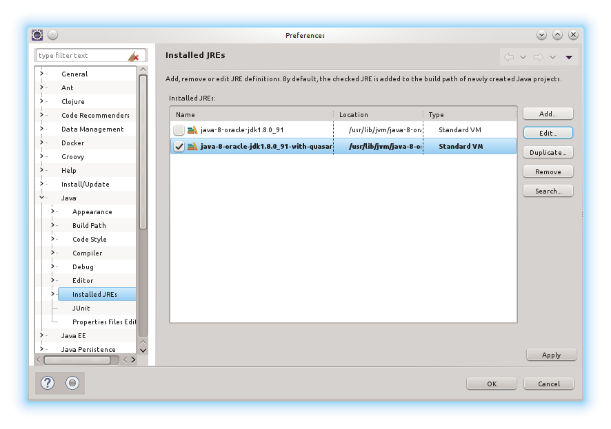
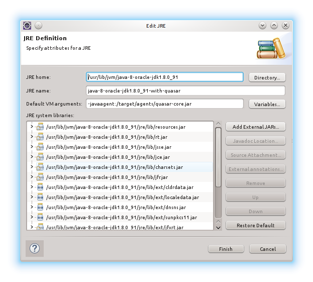
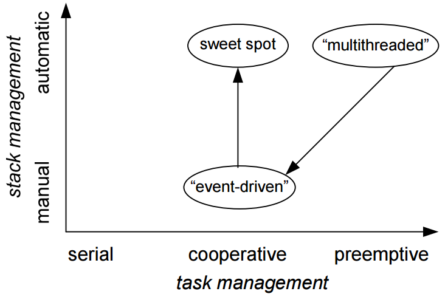
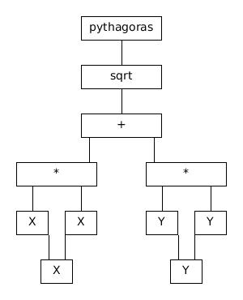
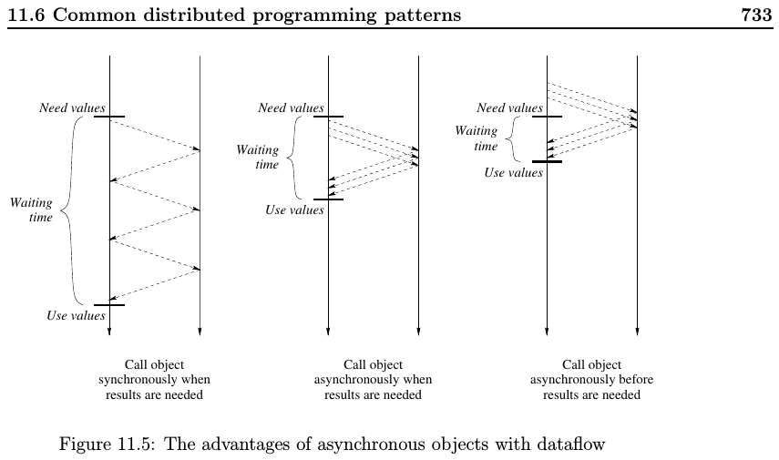
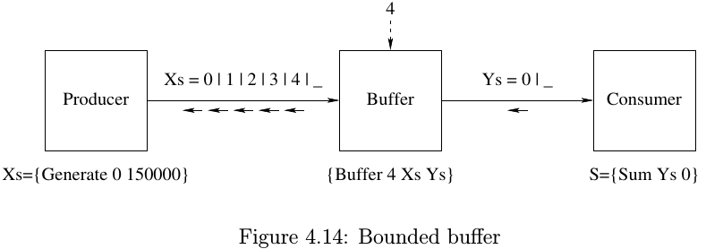
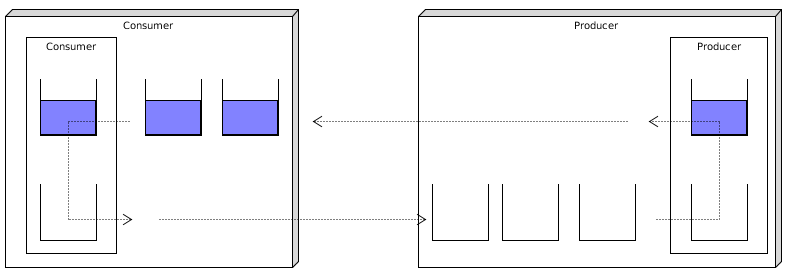

<!--- -*- mode: Markdown; fill-column: 200; coding: utf-8-unix; -*- -->

<!---
http://pandoc.org/README.html#pandocs-markdown
http://daringfireball.net/projects/markdown/syntax

https://www.gnu.org/software/emacs/manual/html_node/emacs/Specifying-File-Variables.html
 M-x add-file-local-variable-prop-line
  -->

# Introduction to Control Structures

## Goals

The goal of this project is to highlight the commonalities and differences of different programming styles, especially:

* (blocking) thread/fibre based
* (non-blocking) event and event stream based
    * Complex Event Processing (CEP)
* (functional) reactive programming (FRP)
    * reactive-extensions (Rx)
* Continuation Passing Style (CPS)
* Communicating Sequential Processes (CSP)
* flow-based programming
* push vs. pull style

## Set-up of workspace in eclipse

Some examples make use of the `fiber` implementation of the [Quasar](http://docs.paralleluniverse.co/quasar) library, which needs a `-javagent` on the command-line. Therefore a little bit of
preliminary set-up work is required.

In order to use all of the code directly from eclipse it is easiest if you configure a second "Installed JRE" in eclipse that will automatically call the required java agent.

The first step is to go into the `control-structures` directory and execute:

~~~~~~~~~~~~~~~~~~~~~~~~~~~~~~~~~~~~~~~~~~ {.bash}
> mvn eclipse:configure-workspace -Declipse.workspace=../
> mvn eclipse:eclipse
> mvn package
~~~~~~~~~~~~~~~~~~~~~~~~~~~~~~~~~~~~~~~~~~

<section class="roundedBorder">
**Don't worry about the stack-traces you see in the test output**. Have a look at the description [below](#stack-traces), which explains the reasoning behind putting these stack traces into the
logging output.
</section>

Optionally you can also set-up a few links in your local `mvn` repository `~/.m2/repository`. This step is not required for the correct functioning of the project but it can help you to work around a
problem of the eclipse plugin to not configure the sources and javadocs correctly if you use a `classifier` like you have to do for the `quasar-core` library.

~~~~~~~~~~~~~~~~~~~~~~~~~~~~~~~~~~~~~~~~~~ {.bash}
> ./set-up-links.sh
~~~~~~~~~~~~~~~~~~~~~~~~~~~~~~~~~~~~~~~~~~

Then you can go two levels up in the directory structure and start eclipse via:

~~~~~~~~~~~~~~~~~~~~~~~~~~~~~~~~~~~~~~~~~~ {.bash}
> eclipse -data dev-meetup-control-structures
~~~~~~~~~~~~~~~~~~~~~~~~~~~~~~~~~~~~~~~~~~

When you do this the first time then the first thing to do is to import the project into eclipse via `File->Import->General->Existing Projects into Workspace`. After that you can set-up the second
"Installed JRE" by duplicating the already existing JRE configuration and adding the javaagent commandline argument as shown in the following two pictures:

<!--- {width=100%} -->

The important part here is the `-javaagent:./target/agents/quasar-core.jar`. Finally set this JRE as the default JRE.

## What is a continuation and what does the Quasar library do for you?

If you are not interested in the long story then just jump down to the [examples](#style-examples).

A [continuation](https://en.wikipedia.org/wiki/Continuation) is a "[goto](https://en.wikipedia.org/wiki/Goto) on steroids" (I always thought
[Felleisen](https://en.wikipedia.org/wiki/Matthias_Felleisen) came up with this slogan first, but I currently cannot find a reference from him; but you can find one
[here](http://stackoverflow.com/questions/11103852/the-seasoned-schemer-letcc-and-guile)). A continuation captures the current program state as a "value" that you can use else-where in the program and
resume the computation from where you left off. A continuation allows you non-local transfer of control like a `goto` (BASIC programming language) or a `JMP` (assembly language) or a `longjmp` (C
language) statement. One of the few "main-stream" programming languages that has support for continuations built-in is the [Scheme](https://en.wikipedia.org/wiki/Scheme_(programming_language)) programming
language (a kind of [Lisp](https://en.wikipedia.org/wiki/Lisp_(programming_language))) via for example the [call/cc](https://en.wikipedia.org/wiki/Call-with-current-continuation) construct.

In nearly all practical cases you do not want a full continuation, but a [delimited continuation](https://en.wikipedia.org/wiki/Delimited_continuation), because they may be reused and composed.

<section class="roundedBorder">
<a name="delimited-continuations">**Delimited Continuations**</a>

You can find further information about delimited continuations and what you can do with them by following the links below:

* [Continuations by example: Exceptions, time-traveling search, generators, threads, and coroutines](http://matt.might.net/articles/programming-with-continuations--exceptions-backtracking-search-threads-generators-coroutines/)
* [delimc](https://github.com/swannodette/delimc) is a library for delimited continuations implemented as macros in Clojure
* [Continuations and delimited control](http://okmij.org/ftp/continuations/) is another good source of information
* [Abstracting Control](http://citeseerx.ist.psu.edu/viewdoc/download?doi=10.1.1.43.8753&rep=rep1&type=pdf) by Olivier Danvy and Andrzej Filinski show how to use delimited continuations for
  implementing "nondeterministic programming (backtracking)"

</section>

&nbsp;

<section class="roundedBorder">
<a name="structured-programming-and-semantic-stacks">**Structured Programming and Semantic Stacks**</a>

As long as programming languages did not have a stack nobody needed a continuation and used `goto` statements. With the introduction of
[structured programming](https://en.wikipedia.org/wiki/Structured_programming) and the [goto considered harmful](https://en.wikipedia.org/wiki/Considered_harmful) discussion most programming languages
banned the `goto` statement, introduced a programming language _semantic_ stack (often even on the machine level as a real stack like in the C language; have a look at "standard segment layout in a
Linux process" [here](http://duartes.org/gustavo/blog/post/anatomy-of-a-program-in-memory/)) and introduced more restricted control flow constructs like `while`, `for`, `switch`, `if-then-else`, ...

For a feel of what it means that the stack is a _semantic_ stack and not a _real_ stack have a look at [Stackless Python](https://en.wikipedia.org/wiki/Stackless_Python). It implements the standard
[Python](https://en.wikipedia.org/wiki/Python_(programming_language)) programming language, but avoids to use the stack internally. This means that you as human have the impression in the head that
there is a stack, but on the machine level no stack is used. Another example comes [further down](#core.async) when we will have a look at `core.async` in Clojure, where you have the impression that there is a
stack, but behind the scenes some compiler techniques are used to rewrite the program into a stackless format.

The stack for a software developer who learned software development after the year 1990 is similar to water for a fish. As nowadays basically **all** programming languages have banned the `goto` and are
languages that fully embrace the learnings from the _structured programming_ debate (which comes hand in hand with using a _semantic_ stack) a software developer does not see the difference any more.  It
is like with a fish that is so used to water that it takes water for a given without ever thinking about it. In a similar way software developers take the stack for so granted that they don't ever
think about it (at least I didn't). The real machine does not need and often does not use a stack at all! The stack is a **_semantic_** construct that helps us as humans to understand what the
computation is supposed to do (on the [semantics](https://en.wikipedia.org/wiki/Semantics_(computer_science)) level of a programming language). The machine doesn't need a stack as can be seen by the
fact that compilers can compile stack based code into code that does not use a stack at all:
[Compiling with Continuations](https://www.amazon.com/Compiling-Continuations-Andrew-W-Appel/dp/052103311X).

The original hint that pointed me in the right direction came via [Peter van Roy](https://www.info.ucl.ac.be/~pvr)'s book
[Concepts, Techniques, and Models of Computer Programming: Distributed Programming](https://www.info.ucl.ac.be/~pvr/VanRoyHaridi2003-book.pdf). He spoke in his book very clearly about the stack as a
_semantic_ construct and introduced it in his [operational semantics](https://en.wikipedia.org/wiki/Operational_semantics) of the [Oz](https://en.wikipedia.org/wiki/Oz_(programming_language)) teaching
programming language. At least for me it took a long time to really understand how the <em><strong>semantic</strong> stack</em> gets into my way and confuses my thinking around
[push vs. pull](http://www.balisage.net/Proceedings/vol3/print/Kay01/BalisageVol3-Kay01.html) or [thread based vs. event based](http://berb.github.io/diploma-thesis/original/043_threadsevents.html)
architectures.

In most cases nobody misses the more powerful goto statement, but there are some cases where a kind of `goto` statement would be useful to avoid the need to rewrite the complete program (we will talk
about these manual re-writes of programs below as "stack-ripping") only to deal with the consequences and restrictions of _structured programming_. For an early example of the discovery of the problem
have a look [here](http://www.balisage.net/Proceedings/vol3/print/Kay01/BalisageVol3-Kay01.html#d119811e501) where they talk about "[Jackson](https://en.wikipedia.org/wiki/Michael_A._Jackson)
Structured Programming and the Concept of Inversion", which is a manual rewrite technique on how to rewrite a _structured program_ to deal with the restrictions that structured programming introduces.
</section>

Based on continuations other constructs can be build like [coroutines](https://en.wikipedia.org/wiki/Continuation#Coroutines) or
[generators](https://en.wikipedia.org/wiki/Generator_(computer_programming)).

Continuations can also be used to implement [cooperative multi-tasking](https://en.wikipedia.org/wiki/Cooperative_multitasking) (in contrast to the
[pre-emptive multi-tasking](https://en.wikipedia.org/wiki/Preemption_%28computing%29) that for example the Linux kernel provides). This is the use-case that we will be most interested in. One can
write a program in the normal structured programming language style using a stack and use techniques that most developers are already used to from multi-threaded programming but still keep everything
lightweight on a single operating system thread without the need for manual re-writes like stack-ripping.

Many people are not clear in their language what they mean when they talk about `threads`. Most often most people conflate the concept of an operating system heavy weight thread providing pre-emptive
multi-tasking and the concept of a _semantic_ stack used as an aid for human software developers in structuring of their programs in a readable and meaningful way. The two terms are related in so far
as an operating system thread also provides an independent stack from other threads (see [here](http://duartes.org/gustavo/blog/post/anatomy-of-a-program-in-memory/)).

In order to avoid confusion I will use the terminology of the Quasar library:

* [Fiber](http://docs.paralleluniverse.co/quasar/#fibers): A fiber is basically a _semantic_ stack independent of an operating system thread that can be used for co-operative multi-tasking. The fiber
  can be implemented by using a real stack data structure like it is done in the Quasar library or it can use compiler re-write techniques like the core.async implementation shows.
    * Other terms you sometimes hear that mean the same thing as `fiber` are `green thread` or `light-weight thread`.
* Thread: A thread is the usual heavy-weight operating system thread construct (like in [POSIX Threads](https://en.wikipedia.org/wiki/POSIX_Threads)) that provides pre-emptive multi-tasking. An
  operating system thread also comes with an independent stack. In that case it is even a real data-structure even supported by hardware via the
  [memory-management unit](https://en.wikipedia.org/wiki/Memory_management_unit) (MMU) and the operating system.
* [Strand](http://docs.paralleluniverse.co/quasar/#strands): The Quasar library creates an abstraction called `Strand` that subsumes both concepts so that from a software development perspective you
  can write a program and decide later if you prefer to use operating-system threads or fibers or even mix the two. Mixing the two is a very useful technique by for example having millions of fibers
  scheduled on the number of real cores your CPU has via operating system threads via the Java [ForkJoinPool](https://docs.oracle.com/javase/8/docs/api/java/util/concurrent/ForkJoinPool.html)
  infrastructure. This can be used to get the maximum throughput out of your computer program.

In the language of Peter van Roy a strand is a _unit of waiting_.

The following paper is also very useful to understand the above mentioned concepts:
[Cooperative Task Management without Manual Stack Management or, Event-driven Programming is Not the Opposite of Threaded Programming](http://citeseerx.ist.psu.edu/viewdoc/summary?doi=10.1.1.20.464). And
I've taken out one picture that I find especially useful for the deeper understanding and have included it below. The goal of this document is to create sensitivity around these topics and show you
how to arrive at the "sweet spot" in the Java programming language on the standard Oracle JVM.

As Java and the JVM do not natively support continuations (actually there is support for native continuations in the
[Da Vinci Machine](https://drive.google.com/viewerng/viewer?url=http://wiki.jvmlangsummit.com/images/2/2b/JVMLanguageSummit_Stadler_Continuations.pdf)) we have to work our way around this
limitation. On the standard Oracle JVM we have the following options:

* [Quasar Library](http://docs.paralleluniverse.co/quasar/#strands) (you might be also interested in reading [Erlang (and Go) in Clojure (and Java)](http://blog.paralleluniverse.co/2013/05/02/quasar-pulsar/))
* [kilim](https://github.com/kilim/kilim)
* [Apache Commons Java Flow](http://commons.apache.org/sandbox/commons-javaflow/)
* [Matthias Mann continuation library](http://www.matthiasmann.de/content/view/24/26/)

Actually the Quasar version is based on the Thomas Mann version but heavily modified/improved. There is also an article about
[Testing Fiber Implementations in JVM](http://vlkan.com/blog/post/2014/09/01/java-fiber-test/) and the
[Java IO Benchmark: Quasar vs. Async ForkJoinPool vs. managedBlock](http://blog.takipi.com/java-io-benchmark-quasar-vs-async-forkjoinpool-vs-managedblock/).

I've chosen the [Quasar library](https://github.com/puniverse/quasar) for my own experiments, because it makes the most complete impression and is under active development and maintained by
[Parallel Universe](http://www.paralleluniverse.co/about/).

### CoIteratorTest

Let's have a look at what you can do with the Quasar library by implementing a CoIterator. The example is taken from the [Matthias Mann web-site](http://www.matthiasmann.de/content/view/24/26/). Have a look at the
`control.structures.continuations.CoIteratorTest` class:

~~~~~~~~~~~~~~~~~~~~~~~~~~~~~~~~~~~~~~~~~~ {.java}
public class CoIteratorTest {
	private static final Logger logger = LoggerFactory.getLogger(CoIteratorTest.class);

	@Test
	public void test() throws ExecutionException, InterruptedException {
		Iterator<String> iter = new TestIterator();
    	try {
    		while(iter.hasNext()) {
    			logger.info(iter.next());
    		}
		} catch (Exception e) {
			String msg = "Unexpected exception thrown.";
			logger.error(msg, e);
			fail(msg);
		}
	}

	public static class TestIterator extends CoIterator<String> implements Serializable {
		private static final long serialVersionUID = 1L;

		@Override
	    protected void run() throws SuspendExecution {
	        produce("A");
	        produce("B");
	        for(int i = 0; i < 4; i++) {
	            produce("C" + i);
	        }
	        produce("D");
	        produce("E");
	    }

	}
}
~~~~~~~~~~~~~~~~~~~~~~~~~~~~~~~~~~~~~~~~~~

If you run this test via JUnit you get the following output:

~~~~~~~~~~~~~~~~~~~~~~~~~~~~~~~~~~~~~~~~~~
[main] INFO  c.s.continuations.CoIteratorTest - test - A
[main] INFO  c.s.continuations.CoIteratorTest - test - B
[main] INFO  c.s.continuations.CoIteratorTest - test - C0
[main] INFO  c.s.continuations.CoIteratorTest - test - C1
[main] INFO  c.s.continuations.CoIteratorTest - test - C2
[main] INFO  c.s.continuations.CoIteratorTest - test - C3
[main] INFO  c.s.continuations.CoIteratorTest - test - D
[main] INFO  c.s.continuations.CoIteratorTest - test - E
~~~~~~~~~~~~~~~~~~~~~~~~~~~~~~~~~~~~~~~~~~

As you can see via the "[main]" element of the logging output all of these activities are happening on the `main` operating system thread and no operating-system based multi-threading is happening. In
a "normal" JVM in "normal" Java this would not be possible, because there is no `return` statement in the `run()` method that calls the `produce()` methods. Therefore you should never be able to
arrive at the `logger.info(iter.next());` statements that uses the iterator.

The Thomas Mann web-site also explains conceptionally what is going on. Conceptionally the code of the iterator body is rewritten via byte-code manipulation via the java agent to something like this:

~~~~~~~~~~~~~~~~~~~~~~~~~~~~~~~~~~~~~~~~~~ {.java}
public class TestIterator implements Iterator<String>, Serializable {
    private int state;
    private int i;
    public String next() {
        switch(state) {
            case 0: state=1; return "A";
            case 1: state=2; i=0; return "B";
            case 2:
              if(i == 3) state = 3;
              return "C" + (i++);
            case 3: state=4; return "D";
            case 4: state=5; return "E";
            default: throw new NoSuchElementException();
        }
    }
    public boolean hasNext() {
        return state < 5;
    }
    public void remove() {
        throw new UnsupportedOperationException("Not supported");
    }
}
~~~~~~~~~~~~~~~~~~~~~~~~~~~~~~~~~~~~~~~~~~

And in addition every "fiber" maintains its own stack. Have a look at the `co.paralleluniverse.fibers.Stack` and `co.paralleluniverse.fibers.Fiber` classes. It is also noteworthy to mention that the
Quasar `fibers` are `Serializable`, which means you can take a given state of a computation, write it to disk, quit the JVM, restart the JVM, read the serialized version of the fiber back and continue
the computation from where you left off. You can also use Quasar fibers in web-sessions of web applications and simply put them into the session scope.

<section class="roundedBorder">
<a name="continuations-and-web-applications">**Continuations and web-applications**</a>

The first time I personally felt the pain of stack-ripping was in the good old times of [Common Gateway Interface](https://en.wikipedia.org/wiki/Common_Gateway_Interface) (CGI) based web-applications
when you had to rewrite entire programs by hand from the "normal" stack based style into a continuation passing style (CPS). The transformation steps are described very well in the paper
[Automatically Restructuring Programs for the Web](http://www.ccs.neu.edu/racket/pubs/ase2001-gfkf.pdf).

At that time I was deeply confused about what is going on here and why this is necessary or what is missing in order to avoid this rewrite. Now in retrospect I would put the problem as follows: a
normal web-application is composed of two co-routines. The one co-routine is the human user in front of the browser and the other co-routine is your computer program running on the server. As we want
to keep the nice and well understandable way of the _semantic_ stack for the human in front of the web-application the server application has to give in and be rewritten. You could avoid the rewrite
in languages that offer support for continuations or coroutines in the first place.
</section>

This is the mechanism via which the Quasar library can create the illusion of a non-local transfer of control and can implement cooperative multi-tasking. The word _cooperative_ is important here,
too. You as developer of constructs like the `CoIterator` have to call `Fiber.park()` in the right places. In operating system threads the operating system is forcing each thread to give up the CPU
core from time to time (that is the meaning of pre-emptive multi-tasking) so that other threads get CPU resources and can run. With Quasar fibers the developer has to call `Fiber.park()` at some
places to cause the transfer of control to another fiber. Otherwise the current fiber will use the CPU "forever".

Each method that calls `Fiber.park()` will need to declare the checked `Exception` called `SuspendExecution`. Like that you can always see in your program in which stack-frame somewhere deep down there
may be a call to `Fiber.park()` or similar. Actually this exception will never be thrown at runtime and you should never catch it. It is only used as a marker by the Quasar library to know which code
blocks to instrument. You could also use the `@Suspendable` annotation instead of the checked exception, but this makes it extremely difficult to ensure that all methods in any call stack that uses your method
also use this annotation.

### Why going through all of that hassle while you can achieve the same thing with operating system threads?

If you just care about the semantics (the meaning and correctness) of your program then there is no reason why not to simply use an operating system thread.

But if you care about low end-to-end latency at the higher percentiles then you might care. Have a look at [Netflix/Hystrix: How it Works](https://github.com/Netflix/Hystrix/wiki/How-it-Works) and
scroll down to "Cost of Threads". There you can see that at the median (and lower) there is no cost to having a separate thread, but if you go to the higher percentiles, e.g. the 99th percentile there
is a cost of 9ms on a basis of roughly 27ms for having a separate thread (e.g. an overhead of roughly 33%).

While the Quasar fibers also cause a bit of overhead this overhead is much lower than the 9ms of an operating system thread.

There is the long standing argument of what is better, event based programming or thread/stack based programming. In the late 70s Lauer and Needham came up with their duality argument, which basically
says that you can convert mechanically from the one paradigm to the other, e.g. they are equivalent. For more details have a look at
[The Case of Threads vs. Events](http://berb.github.io/diploma-thesis/original/043_threadsevents.html).

There is actually some content to the argument, but only if you look at operating system threads, e.g. the blocking IO vs. non-blocking IO debate. Here is again a lot of confusion in the wild! People
often say that non-blocking / event-based IO is performing better without saying what they mean with performance. Actually blocking IO (thread/stack style) is nearly always better if you focus on low
end-to-end latencies and non-blocking IO (event style) is basically always better if you look at the scalability of systems, e.g. with how many concurrent connections a web-server can deal for
example. For the latter case have a look at [C10k problem](https://en.wikipedia.org/wiki/C10k_problem). The term was coined in 1999 by Dan Kegel. For many web applications end-to-end latencies below
100ms do not matter, but being able to serve more than 10k customers per instance of the web-server does matter. This is why many people focus on non-blocking event based systems.

But this is one of the few cases where you can eat the cake and have it, too! as outlined in
[Cooperative Task Management without Manual Stack Management or, Event-driven Programming is Not the Opposite of Threaded Programming](http://citeseerx.ist.psu.edu/viewdoc/summary?doi=10.1.1.20.464). You
can keep the nice programming style of blocking IO without paying the price of operating system threads by using fibers!

### Should the JVM support natively continuations and/or the tail-call optimization? {#should-jvm-support-continuations-natively}

Having a real stack data-structure like the JVM does at runtime and not only having a _semantic_ stack that is "just" part of the programming language specification, but "compiled away" via the compiler (or
optimized away like in the [tail-call optimization](http://www.drdobbs.com/jvm/tail-call-optimization-and-java/240167044) (TCO)) has its advantages, especially when debugging running programs or
printing log statements into log files that help you later in production to understand what your program did in certain problem scenarios that you need to analyze.

In Java on the JVM the runtime stack can be used in log statements and stack-traces can be printed that show you exactly the call-stack how you arrived where you are. You will see in code that makes
heavy use of closures that stack traces become rapidly useless, because you introduce a non-locality of where you define the code to execute and where in the program at a later stage you actually
execute it. In a similar way in implementations that compile the stack away or optimize it away the runtime environment cannot support you any longer in providing meaningful context for stack-traces
or similar.

Another area to watch out for are standard `try-catch-finally` constructs, because this construct relies on the stack! Somewhere further down the stack an exception is thrown and caught further up the
stack. Now I am not a compiler expert and I believe that there are ways around this problem even without using a real stack data structure in the runtime environment, but I guess the world becomes
more difficult then.

<section class="roundedBorder">
<a name="actors">**Actors**</a>

In an actor system that uses fine-grained actors you throw away the advantages of the stack without need! In my opinion, the reason of why actor systems with fine-grained actors proclaim the
[Let It Crash!](https://www.infoq.com/presentations/erlang-reliable-services) slogan is, because they do not have any other choice!! And they make a virtue out of necessity.

If you do not have a stack that explains you where you are in your program at runtime you cannot make use of a `try-catch-finally` construct. The state that is normally on the stack is in some
`queues` (I will talk later about the fact that program state needs to be somewhere; if in a Java program some of the state lives on the stack then in other languages or paradigms where you do not
make use of the stack that state needs to exist elsewhere; options are the (static) flow-networks in flow-based programming or explicit or implicit queues) and `try-catch-finally` does not work with
the state in queues.

The goal of any anomalous state handling mechanism like `try-catch-finally` or "Let It Crash!" (I actually only know of one third way, which is the Common Lisp
[Condition System](https://www.cs.cmu.edu/Groups/AI/html/cltl/clm/node312.html), which also uses the stack) is to get back to a program state at runtime that is fully known to the human software
developer and based on which he can reason about how to continue.

The `try-catch-finally` causes some sort of `reset` and clean-up of the program state to a well-known state (beware of left over state that you keep on the heap!! that perhaps does not get
automatically cleaned up and may bite you later) that is (should be) the same as when you arrived at that stack position the first time. You lose all references to objects and stack frames further
down the stack and they get garbage collected.

In a language that uses fine-grained actors after arriving at some anomalous program state you also need to make sure to continue any further computation from a well-known start state. This is where
"Let It Crash!" comes in. One actor that notices an anomalous program state kills itself and communicates that fact via [links](http://learnyousomeerlang.com/errors-and-processes) and
[supervisors](http://learnyousomeerlang.com/supervisors) to the other actors that participate in the overall computation and the supervisors take care to take the whole program down and restart with a
clean slate. This is the mechanism by which fine-grained actor systems achieve the same result as with a `try-catch-finally`.

But while `try-catch-finally` feels like a scalpel the "Let It Crash!" feels like a hammer! This is one of the main reasons why I am very sceptical of fine-grained actor systems and I prefer to follow
the line of thought of Peter van Roy that he outlines in
[Convergence in Language Design: A Case of Lightning Striking Four Times in the Same Place](https://www.info.ucl.ac.be/~pvr/flopsPVRarticle.pdf):

* The inner layer is a strict functional language.
* The second layer adds deterministic concurrency. Deterministic concurrency is sometimes called declarative or dataflow concurrency. It has the property that it cannot have race conditions. This form
  of concurrency is as simple to reason in as functional programming.
* The third layer adds asynchronous message passing. This leads to a simple message-passing model in which concurrent entities send messages asynchronously. This is the actor layer.
* The fourth layer adds global shared mutable state.

Each lower layer behaves greedy in the same way as a `*` operator in a regular expression is a [greedy](http://www.rexegg.com/regex-quantifiers.html) operator. You only use higher levels iff and only
iff you cannot achieve your goals by staying in the lower layer.

You still need actors in that design philosophy (the third layer), but they will be large or even huge and you typically create them in a highly resilient form like in
[Implementing Fault-Tolerant Services Using the State Machine Approach](https://www.cs.cornell.edu/fbs/publications/SMSurvey.pdf) with redundancy via
[log-replication](https://raft.github.io/slides/raftuserstudy2013.pdf) and crash recovery.

On the second layer you can still keep the stack and stay in the `try-catch-finally` world for simpler human reasoning around anomalous program states.

</section>

I've also read that the JVM security and sandbox models heavily depend on the stack, but I don't know more details about that.

All in all I believe that we might live in the best world with Java and the JVM keeping its stack data structure in the runtime environment and using libraries like Quasar to use continuations
nevertheless.

## Style Examples {#style-examples}

We will use a very contrived example in order to focus on the different techniques and not letting the complexity of the example get into the way of understanding the paradigms.

I will use the [logic block](https://learn.sparkfun.com/tutorials/logicblocks-experiment-guide/4-combinational-logic) notation of
[combinational logic](http://en.wikipedia.org/wiki/Combinational_logic) in electronics to describe the working example. If you are not familiar with this notation then simply look at the following
tutorial: <https://manual.eg.poly.edu/index.php/Digital_Logic>. The only difference that I will make is that in my notation the input is at the bottom (not on the left) and the output will be at the top
(not on the right).

This is a representation of a program that calculates the distance of a point in a [Euclidean plane](http://en.wikipedia.org/wiki/Two-dimensional_space) from the origin according to the formula of
[Pythagoras](http://en.wikipedia.org/wiki/Pythagorean_theorem). The input X and Y at the bottom may either come from a human user typing the values on the console or be hard coded in the program. We
will look at both possibilities.

This notation has the advantage that it shows the essence of the calculation and also shows the degrees of freedom that in principle exist in the solution, e.g. the
[commutative property](https://en.wikipedia.org/wiki/Commutative_property) that it does not matter if you calculate the $x^2$ or the $y^2$ first. In any concrete implementation running on a single CPU
core the implementation has to choose a sequence, though.

The other degree of freedom is if and how we use the programming language stack for implementing the solution. At least for me it took a long time to really understand how the
<em><strong>semantic</strong> stack</em> gets into my way and confuses my thinking around [push vs. pull](http://www.balisage.net/Proceedings/vol3/print/Kay01/BalisageVol3-Kay01.html) or
[thread based vs. event based](http://berb.github.io/diploma-thesis/original/043_threadsevents.html) architectures. Have a look at [**Structured Programming and Semantic Stacks**](#structured-programming-and-semantic-stacks) above.

<section class="roundedBorder">
**Play with adapting the log levels in logback.xml**

When running the examples try using different log levels in logback.xml to see either more or less detail of what is going on as you see fits.
</section>

### Single threaded {#stack-traces}

The style examples are all single-threaded but may use multiple fibers. You run them via the unit tests defined in `control.structures.examples.GivenAnEuclideanPoint`. Please pay attention to the
logging output. In there you should notice the name of the JVM/operating system thread on which each piece of computation is running which should be `[main]` in all cases. This means that even if
sometimes the code looks like multi-threaded code it is not. It is using fibers.

Please **do not worry about the exception stacks** that are printed in the logging output. I print the stack-traces at certain places to show you the structure of the program stack at that point at
runtime.

### Plain function instruction by instruction with local variables

The problem is so simple that you can implemented it as a single function. You can implement it instruction by instruction and use local variables to give names to intermediate results to make the
computation for a human a bit more readable:

~~~~~~~~~~~~~~~~~~~~~~~~~~~~~~~~~~~~~~~~~~ {.java}
	public static double pythagoras_function_call_with_local_variables(double x, double y) {
		double xsquared = times(x, x);
		double ysquared = times(y, y);
		double squaresum = plus(xsquared, ysquared);
		double distance = sqrt(squaresum);
		return distance;
	}
~~~~~~~~~~~~~~~~~~~~~~~~~~~~~~~~~~~~~~~~~~

I've used functions like `times` and `plus` and `sqrt` in all places where the logic block notation contains a function block just to stay as close as possible to the diagram. In this implementation
I've chosen to perform the $x^2$ first before the $y^2$ but the correctness of the solution would of course not suffer from changing the order around here.

### Function calls per level

You could perform the computation without local variables and simply replace all places in the example above where we used a local variable with the direct function call:

~~~~~~~~~~~~~~~~~~~~~~~~~~~~~~~~~~~~~~~~~~ {.java}
	public static double pythagoras_function_calls_per_level(double x, double y) {
		return sqrt(plus(times(x,x),times(y,y)));
	}
~~~~~~~~~~~~~~~~~~~~~~~~~~~~~~~~~~~~~~~~~~

It is interesting to note that the human readability changes from bottom-up to top-down (in the sense of the logic block diagram). For the machine nothing changes.

You might ask yourself if a stack is built up by this example in the case that the `times` function is called. The answer is "no", there are no additional stack frames built up as can be seen by the
stack traces:

~~~~~~~~~~~~~~~~~~~~~~~~~~~~~~~~~~~~~~~~~~
[main] DEBUG c.structures.examples.Pythagoras - times - stack java.lang.Exception: stack
	at control.structures.examples.Pythagoras.times(Pythagoras.java:334)
	at control.structures.examples.Pythagoras.pythagoras_function_calls_per_level(Pythagoras.java:45)
~~~~~~~~~~~~~~~~~~~~~~~~~~~~~~~~~~~~~~~~~~

Compared to the example above this is the same stack depth:

~~~~~~~~~~~~~~~~~~~~~~~~~~~~~~~~~~~~~~~~~~
[main] DEBUG c.structures.examples.Pythagoras - times - stack java.lang.Exception: stack
	at control.structures.examples.Pythagoras.times(Pythagoras.java:334)
	at control.structures.examples.Pythagoras.pythagoras_function_call_with_local_variables(Pythagoras.java:34)
~~~~~~~~~~~~~~~~~~~~~~~~~~~~~~~~~~~~~~~~~~

The reason for that is that Java uses [eager evaluation](https://en.wikipedia.org/wiki/Eager_evaluation) call-by-value left to right of its parameters to functions as its
[evaluation strategy](https://en.wikipedia.org/wiki/Evaluation_strategy). There are programming languages like [Haskell](https://en.wikipedia.org/wiki/Haskell_%28programming_language%29) that follow a
different model, e.g. lazy evaluation / call-by-need.

### Function calls per level with lazy / call-by-need evaluation

You can simulate the call-by-need lazy evaluation in Java by using lambdas as follows:

~~~~~~~~~~~~~~~~~~~~~~~~~~~~~~~~~~~~~~~~~~ {.java}
	public static Supplier<Double> plus_by_need(Supplier<Double> a, Supplier<Double> b) {
		return () -> {logger.debug("plus_by_need"); return a.get() + b.get();};
	}

	public static Supplier<Double> sqrt_by_need(Supplier<Double> a) {
		return () -> {logger.debug("sqrt_by_need"); return Math.sqrt(a.get());};
	}

	public static double pythagoras_function_calls_per_level_by_need(double x, double y) {
		return sqrt_by_need(plus_by_need(() -> times(x,x), () -> times(y,y))).get();
	}
~~~~~~~~~~~~~~~~~~~~~~~~~~~~~~~~~~~~~~~~~~

Once you do that you'll also see a call stack several levels deep until the inner-most function, the `times` function is called:

~~~~~~~~~~~~~~~~~~~~~~~~~~~~~~~~~~~~~~~~~~
[main] DEBUG c.structures.examples.Pythagoras - lambda$45 - sqrt_by_need
[main] DEBUG c.structures.examples.Pythagoras - lambda$44 - plus_by_need
[main] DEBUG c.structures.examples.Pythagoras - times - stack java.lang.Exception: stack
	at control.structures.examples.Pythagoras.times(Pythagoras.java:341)
	at control.structures.examples.Pythagoras.lambda$0(Pythagoras.java:52)
	at control.structures.examples.Pythagoras.lambda$44(Pythagoras.java:350)
	at control.structures.examples.Pythagoras.lambda$45(Pythagoras.java:358)
	at control.structures.examples.Pythagoras.pythagoras_function_calls_per_level_by_need(Pythagoras.java:52)
~~~~~~~~~~~~~~~~~~~~~~~~~~~~~~~~~~~~~~~~~~

<section class="roundedBorder">
**Call-by-need in Java 8 for simplified logging**

It is worthwhile to note that Java 8 makes use of this call-by-need evaluation in its logging framework to avoid the performance penalty of evaluating logging statements that may not be needed if
the logging level is set to a value that does not require an output to be generated (the example is taken from
[here](https://garygregory.wordpress.com/2015/09/16/a-gentle-introduction-to-the-log4j-api-and-lambda-basics/)).

Often you see statements like the following in performance critical code:

~~~~~~~~~~~~~~~~~~~~~~~~~~~~~~~~~~~~~~~~~~ {.java}
// Guards against calling compute
if (logger.isDebugEnabled()) {
  logger.debug("This {} and {} with {} ", this, that, compute());
}
~~~~~~~~~~~~~~~~~~~~~~~~~~~~~~~~~~~~~~~~~~

In Java 8 you can use the following call-by-need logging construct to avoid the overhead of the computation in case that the debug log-level is not turned on:

~~~~~~~~~~~~~~~~~~~~~~~~~~~~~~~~~~~~~~~~~~ {.java}
// Uses Java 8 lambdas to build arguments on demand
logger.debug("I am logging that {} happened.", () -> compute());
~~~~~~~~~~~~~~~~~~~~~~~~~~~~~~~~~~~~~~~~~~

The key expression is worth repeating:

~~~~~~~~~~~~~~~~~~~~~~~~~~~~~~~~~~~~~~~~~~ {.java}
() -> compute()
~~~~~~~~~~~~~~~~~~~~~~~~~~~~~~~~~~~~~~~~~~
</section>

You could call the call-by-need style a ***pull-based*** (thread/stack style) approach, because at the top-level where a result is needed it "pulls" all relevant computations further "down" into the
picture. Pull based basically means a top-down approach if you look at the logic block diagram. In that regard also the "function calls per level" solution is a pull-based approach.

### Continuation Passing Style (CPS) {#cps-style}

[Continuation Passing Style](https://en.wikipedia.org/wiki/Continuation-passing_style) (CPS) is a style that is relatively seldom used by humans, but quite often used by compilers (see:
[Compiling with Continuations](https://www.amazon.com/Compiling-Continuations-Andrew-W-Appel/dp/052103311X)).

~~~~~~~~~~~~~~~~~~~~~~~~~~~~~~~~~~~~~~~~~~ {.java}
	public static double pythagoras_continuation_passing_style(double x, double y) {
		final AtomicReference<Double> result = new AtomicReference<Double>();
		times_cps(x, x,
			(Double i) -> times_cps(y, y,
				(Double j) -> plus_cps(i, j,
					(Double k) -> sqrt_cps(k,
							(Double l) -> identity(l, result)
						)
					)
				)
			);

		return result.get();
	}

	public static void times_cps(double a, double b, Consumer<Double> k) {
		k.accept(a * b);
	}

	public static void plus_cps(double a, double b, Consumer<Double> k) {
		k.accept(a + b);
	}

	public static void sqrt_cps(double a, Consumer<Double> k) {
		k.accept(Math.sqrt(a));
	}

	public static void identity(double a, AtomicReference<Double> result) {
		result.set(a);
	}
~~~~~~~~~~~~~~~~~~~~~~~~~~~~~~~~~~~~~~~~~~

It is worthwhile to note that in this variant you're back to a bottom-up human readability mode. In addition you have to fix the order of what you compute first, either the $x^2$ or the $y^2$.

It is also worthwhile to note how you have to adapt the two styles, e.g. if you want to get out a result from that computation. In that case you have to provide a function that does nothing, e.g. the
`identity` function, but only puts the result into a holder variable like an `AtomicReference`. This does not have to be an `atomic` reference, I only used it because it is a standard _holder_ type
available in the standard JDK.

You also have to be aware that this style accumulates in the Java programming language a deep stack, e.g. you run the danger of running into a `StackOverflowError`. Languages that implement
[tail-call optimization](https://en.wikipedia.org/wiki/Tail_call) do not run into that problem. What I want to say is: this is a problem of the Java implementation and not a general conceptual
problem with this approach (also have a look at [Should the JVM support natively continuations and/or the tail-call optimization?](#should-jvm-support-continuations-natively) above):

~~~~~~~~~~~~~~~~~~~~~~~~~~~~~~~~~~~~~~~~~~
[main] DEBUG c.structures.examples.Pythagoras - identity - stack java.lang.Exception: stack
	at control.structures.examples.Pythagoras.identity(Pythagoras.java:395)
	at control.structures.examples.Pythagoras.lambda$49(Pythagoras.java:73)
	at control.structures.examples.Pythagoras.sqrt_cps(Pythagoras.java:390)
	at control.structures.examples.Pythagoras.lambda$48(Pythagoras.java:72)
	at control.structures.examples.Pythagoras.plus_cps(Pythagoras.java:385)
	at control.structures.examples.Pythagoras.lambda$47(Pythagoras.java:71)
	at control.structures.examples.Pythagoras.times_cps(Pythagoras.java:380)
	at control.structures.examples.Pythagoras.lambda$2(Pythagoras.java:70)
	at control.structures.examples.Pythagoras.times_cps(Pythagoras.java:380)
	at control.structures.examples.Pythagoras.pythagoras_continuation_passing_style(Pythagoras.java:69)
~~~~~~~~~~~~~~~~~~~~~~~~~~~~~~~~~~~~~~~~~~

Basically if you have a function that takes input arguments `i1` until `in` and produces a result of type `T`:

~~~~~~~~~~~~~~~~~~~~~~~~~~~~~~~~~~~~~~~~~~ {.java}
	public static double fn(double i1, double i2, double in) {
		return 0.0;
	}
~~~~~~~~~~~~~~~~~~~~~~~~~~~~~~~~~~~~~~~~~~

Then, in order to arrive at the CPS variant of that function you convert it into a function that has no return value, but instead has one input parameter more, which is a function that again does not
produce any result but only consumes one argument of type `T`:

~~~~~~~~~~~~~~~~~~~~~~~~~~~~~~~~~~~~~~~~~~ {.java}
	public static void fn_cps(double i1, double i2, double in, Consumer<Double> k) {
		k.accept(0.0);
	}
~~~~~~~~~~~~~~~~~~~~~~~~~~~~~~~~~~~~~~~~~~

The first time I came across this transformation was in [Automatically Restructuring Programs for the Web](http://www.ccs.neu.edu/racket/pubs/ase2001-gfkf.pdf). This is from a time when many people
still created their web-applications via [Common Gateway Interface](https://en.wikipedia.org/wiki/Common_Gateway_Interface) (CGI). You do not have to put any brain-power into that transformation. It
is purely mechanical and it can be done by compilers or by byte-code-manipulation or any other automatic tooling. Have a look at
[Continuations and web-applications](#continuations-and-web-applications) above for more details.

You could call the CPS style a ***push-based*** (event-driven) approach, because you start it from the bottom of the logic block diagram.

This push (event-driven) vs. pull (thread/stack style) is only happening in the head of a human. On a single core CPU both approaches will more or less exactly do the same things in the same sequence
no matter which approach you use. The machine does not know anything about push vs. pull, only about sequences of CPU instructions. The distinction between push vs. pull happens due to the fact that
humans use this vocabulary when they think about the logic block diagram picture either from bottom-to-top or from top-to-bottom.

Please also note that the CPS transform is **contagious**. It behaves like a virus. If you start to convert your program into CPS-style at one place you will soon end-up rewriting and transforming
your whole program.

### Data-flow using data-flow variables

The [Quasar](http://docs.paralleluniverse.co/quasar/) library comes with a [dataflow](http://docs.paralleluniverse.co/quasar/#dataflow-reactive-programming) implementation. The construct `Val` creates
a dataflow variable (see Peter van Roy: [Concepts, Techniques, and Models of Computer Programming: Distributed Programming](https://www.info.ucl.ac.be/~pvr/VanRoyHaridi2003-book.pdf); single
assignment variable) that then can be passed around in your program.

<section class="roundedBorder">
**Dataflow variables in Java 8**

Since Java 8 the JDK also has an implementation of a dataflow variable, the [CompletableFuture](http://www.nurkiewicz.com/2013/05/java-8-definitive-guide-to.html). As the CompletableFuture will only work with operating system threads, but not with Quasar fibers we will use the Quasar `Val` implementation.

It is worthwhile to note that traditionally actor systems like Erlang did not come along with dataflow variables. The [Akka](http://akka.io/) JDK actor framework actually introduced
[Oz-style dataflow concurrency](http://doc.akka.io/docs/akka/2.3-M1/scala/dataflow.html) with dataflow variables (sometimes also called [promises](https://en.wikipedia.org/wiki/Futures_and_promises))
to enable a complementary way of writing synchronous-looking code that in reality is asynchronous.

Peter van Roy and team added dataflow variables to Erlang in the Derflow project as part of [SyncFree](https://syncfree.lip6.fr/) project and describe it in
[Derflow: Distributed Deterministic Dataflow Programming for Erlang](https://www.info.ucl.ac.be/~pvr/erlang14cameraready.pdf) so that this convenient style can also be used in Erlang.
</section>

The construct `Var` creates a "continuous computation`. Whenever the inputs change the continuous computation re-computes and updates its outputs. The example looks like this:

~~~~~~~~~~~~~~~~~~~~~~~~~~~~~~~~~~~~~~~~~~ {.java}
	public static double pythagoras_dataflow(double x, double y) {
		Val<Double> vx = new Val<>();
		Val<Double> vy = new Val<>();

		Var<Double> distance = pythagoras_dataflow_flownetwork_definition(vx, vy);

		vx.set(x);
		vy.set(y);

		try {
			return distance.get();
		} catch (SuspendExecution | InterruptedException e) {
			return -1.0;
		}
	}

	public static Var<Double> pythagoras_dataflow_flownetwork_definition(Val<Double> x, Val<Double> y) {
		Var<Double> xsquared = new Var<>(() -> times(x.get(), x.get()) );
		Var<Double> ysquared = new Var<>(() -> times(y.get(), y.get()) );
		Var<Double> squaresum = new Var<>(() -> xsquared.get() + ysquared.get());
		return new Var<>(() -> Math.sqrt(squaresum.get()));
	}
~~~~~~~~~~~~~~~~~~~~~~~~~~~~~~~~~~~~~~~~~~

<section class="roundedBorder">
**Incremental Computing: (Functional) Reactive Programming & Dataflow Programming & Complex Event Processing & Event Stream Processing**

This dataflow solution is a version of (functional) reactive programming ([FRP](https://en.wikipedia.org/wiki/Functional_reactive_programming)). The following video by
[Evan Czaplicki](http://evan.czaplicki.us/), the creator of the [Elm](http://elm-lang.org/) programming language, gives a very good overview of the different styles of FRP in the wild, where
[Rx](http://reactivex.io/) style reactive-programming, like in [RxJava](https://github.com/ReactiveX/RxJava), is just one of them:
[Controlling Time and Space: understanding the many formulations of FRP](https://www.youtube.com/watch?v=Agu6jipKfYw).

The book [Dataflow and Reactive Programming Systems](https://leanpub.com/dataflowbook) by Matt Carkci is another good source to get an overview of the design choices you have to make when you
implement data-flow reactive programming systems.

FRP is a version of [incremental computing](https://en.wikipedia.org/wiki/Incremental_computing) and if you are interested in this topic I recommend that you follow some of the links here:

* [Alexey Radul](http://web.mit.edu/~axch/www/): The art of the propagator
    * [paper](http://dspace.mit.edu/handle/1721.1/44215)
    * [presentation/video](https://vimeo.com/12184930)
    * Clojure: [propaganda library](https://github.com/tgk/propaganda)
        * [presentation/video](https://www.youtube.com/watch?v=JXOOO9MLvhs&feature=youtu.be)
        * [Getting hot with propagators](http://tgk.github.io/2014/01/getting-hot-with-propagators.html)
        * [Taking propagators to the next level](http://tgk.github.io/2014/01/taking-propagators-to-the-next-level.html)
* Umut Acar: [Self-Adjusting Computation](http://www.umut-acar.org/self-adjusting-computation)
* Bidirectional Programming (Lenses): [papers](http://www.cis.upenn.edu/~bcpierce/papers/index.shtml#Lenses) by Benjamin Pierce
* [Dataflow Programming](https://en.wikipedia.org/wiki/Dataflow_programming)
    * [Dataflow and Reactive Programming Systems](https://leanpub.com/dataflowbook)
    * [Ptolemy II](http://ptolemy.eecs.berkeley.edu/ptolemyII/index.htm): The Ptolemy Project has developed directors supporting process networks (PN), discrete-events (DE), dataflow (SDF),
      synchronous/reactive(SR), rendezvous-based models, 3-D visualization, and continuous-time models.
    * [Ohua](https://bitbucket.org/ohuadevelopment/ohua): Ohua is an implementation of the stateful functional programming model along with a dataflow execution engine as a runtime system. It is developed by
      Sebastian Ertel. He is a researcher at the university of Dresden and created the Ohua framework in several incarnations. Some parts of a previous version of Ohua are also
      described in: [Flow-Based Programming, 2nd Edition: A New Approach to Application Development](https://www.amazon.com/Flow-Based-Programming-2nd-Application-Development/dp/1451542321).
    * [Controlling Time and Space: understanding the many formulations of FRP](https://www.youtube.com/watch?v=Agu6jipKfYw) by Evan Czaplicki already mentioned above.
        * The best summary of [Functional Reactive Programming](https://en.wikipedia.org/wiki/Functional_reactive_programming) I've found so far is the video by Evan Czaplicki, but the paper
          [Embedding dynamic dataflow in a call-by-value language](http://citeseerx.ist.psu.edu/viewdoc/summary?doi=10.1.1.94.3398) also describes very well how
          [FrTime](http://docs.racket-lang.org/frtime/index.html) implements the challenges in the Scheme programming language.
    * [Reactive Extensions (Rx)](http://reactivex.io/), in Java: [RxJava](https://github.com/ReactiveX/RxJava) (by Netflix). The Microsoft documentation about Rx is best:
      [Introduction to Rx](http://www.introtorx.com/), and it can be one-to-one transferred to understanding RxJava.

Just as a side remark, the above implementation is very much what [Complex Event Processing](https://en.wikipedia.org/wiki/Complex_event_processing) (CEP) frameworks do under the hood. In addition to
the above _operator_ or _primitive_ style they may allow you to formulate your flow-networks via a language similar to [SQL](https://en.wikipedia.org/wiki/Event_stream_processing).

This is also relevant for the argument of threads vs. events, because as shown in
[Sequentialising a concurrent program using continuation-passing style](https://www.irif.univ-paris-diderot.fr/~jch/research/popl12.pdf) you go from threads to events via the continuation passing
style transformation (there is also a paper around this topic from the same author: [Continuation-Passing C: Compiling threads to events through continuations](http://arxiv.org/pdf/1011.4558.pdf)).
</section>

### Communicating Sequential Processes (CSP)

[Communicating Sequential Processes](https://en.wikipedia.org/wiki/Communicating_sequential_processes) (CSP) is a style originally proposed by [Tony Hoare](https://en.wikipedia.org/wiki/Tony_Hoare)
and described in his [book](https://www.amazon.com/Communicating-Sequential-Processes-International-Computing/dp/0131532715) (also available [online](http://www.usingcsp.com/cspbook.pdf)).

The example looks like this:

~~~~~~~~~~~~~~~~~~~~~~~~~~~~~~~~~~~~~~~~~~ {.java}
	public static double pythagoras_communicating_sequential_processes_style(double x, double y) {
		final Channel<Double> xc = Channels.newChannel(1, OverflowPolicy.BLOCK);
		final Channel<Double> xc_square = Channels.newChannel(1, OverflowPolicy.BLOCK);

		@SuppressWarnings("unused")
		final Fiber<Void> f1 = fiber(() -> {
			while(!xc.isClosed()) {
				Double receive = xc.receive();
				logger.debug("CSP-style: xc.receive(): " + receive);
				xc_square.send(receive * receive);
			}
			xc_square.close();
		});

		final Channel<Double> yc = Channels.newChannel(1, OverflowPolicy.BLOCK);
		final Channel<Double> yc_square = Channels.newChannel(1, OverflowPolicy.BLOCK);

		@SuppressWarnings("unused")
		final Fiber<Void> f2 = fiber(() -> {
			while(!yc.isClosed()) {
				Double receive = yc.receive();
				logger.debug("CSP-style: yc.receive(): " + receive);
				yc_square.send(receive * receive);
			}
			yc_square.close();
		});

		final Channel<Double> square_sum = Channels.newChannel(1, OverflowPolicy.BLOCK);

		@SuppressWarnings("unused")
		final Fiber<Void> f3 = fiber(() -> {
			for(;;){
				if(xc_square.isClosed() || yc_square.isClosed())
					break;
				Double p1 = xc_square.receive();
				Double p2 = yc_square.receive();
				logger.debug("CSP-style: p1, p2: " + p1 + ", " + p2);
				square_sum.send(p1 + p2);
			}
			xc_square.close();
			yc_square.close();
			square_sum.close();
		});

		final Channel<Double> result = Channels.newChannel(1, OverflowPolicy.BLOCK);

		@SuppressWarnings("unused")
		final Fiber<Void> f4 = fiber(() -> {
			while(!square_sum.isClosed()) {
				Double p = square_sum.receive();
				logger.debug("CSP-style: square_sum.receive(): " + p);
				result.send(Math.sqrt(p));
			}
			result.close();
		});

		final AtomicReference<Double> r = new AtomicReference<>();

		@SuppressWarnings("unused")
		final Fiber<Void> f5 = fiber(() -> {
			yc.send(y);
			xc.send(x);
			r.set(result.receive());
		});

		return r.get();
	}
~~~~~~~~~~~~~~~~~~~~~~~~~~~~~~~~~~~~~~~~~~

The example looks more complicated than it actually is. In the end you create channels that are used like variables to which you assign values and from which you read values between the calculation
units.

<section class="roundedBorder">
<a name="core.async">**Clojure(Script) core.async**</a>

I would like to mention the [`core.async`](https://github.com/clojure/core.async) Clojure(Script) library that allows you to use this style even in single threaded environments like JavaScript.

Internally core.async converts the language that makes use of the semantic stack into [static single assignment form](https://en.wikipedia.org/wiki/Static_single_assignment_form) (SSA). This is a
state machine version of the code and the details are quite well explained in [the-state-machines-of-core-async](http://hueypetersen.com/posts/2013/08/02/the-state-machines-of-core-async/). Besides
the inventor of Clojure, [Rich Hickey](https://www.infoq.com/author/Rich-Hickey), the second person contributing to core.async was [Timothy Baldridge](https://github.com/halgari). In the following
stack-overflow thread people explain the details of this state machine transformation and give further links:
[clojure-inversion-of-control-macro](http://stackoverflow.com/questions/17614813/clojure-inversion-of-control-macro-timothy-baldridge). Here is a presentation/video by Timothy Baldrige:
[Core Async Go Macro Internals - Part I](https://www.youtube.com/watch?v=R3PZMIwXN_g). Clojure uses macros to implement this compiler step and they call it inversion-of-control (also have a look
[here](http://www.balisage.net/Proceedings/vol3/print/Kay01/BalisageVol3-Kay01.html#d119811e501) where they talk about "[Jackson](https://en.wikipedia.org/wiki/Michael_A._Jackson) Structured
Programming and the Concept of Inversion"; this is the same meaning of inversion as the use in the core.async lingo), not to be confused with dependency injection!

As Java and the JVM do not support [tail-call optimization](http://www.drdobbs.com/jvm/tail-call-optimization-and-java/240167044) (TCO) you can run into stack-overflows with recursive
functions. Typically you solve this in Clojure with the [`recur`](https://clojuredocs.org/clojure.core/recur) construct or by
[`trampolining`](http://jakemccrary.com/blog/2010/12/06/trampolining-through-mutual-recursion/). But the following blog post explains how you can achieve a stack-less version of a recursive algorithm
that does not run into a stack-overflow by using core.async: [stackless-clojure-with-coreasync](http://programming-puzzler.blogspot.de/2013/07/stackless-clojure-with-coreasync_7.html).

The following presentation/video shows how to visualize the SSA transform of core.async via a graph visualization library [loom](https://github.com/aysylu/loom): <http://tm.durusau.net/?p=48953> (it
is her third example, e.g. you will have to watch it towards the last third of the video).

Core.async seems to really pick up in HTML5 web development by using [ClojureScript](https://github.com/clojure/clojurescript). ClojureScript compiles Clojure into JavaScript. In JavaScript you do not
have real threads (well, recently they introduced [web workers](https://en.wikipedia.org/wiki/Web_worker) into the browser, but these are heavyweight constructs) and therefore core.async allows you to
write code as if you had real threads and the library does the hard work for you to convert it into sequential code. A simple/trivial example of what you can do with core.async and its green-threads
can be seen here: [10000-processes](http://swannodette.github.io/2013/08/02/100000-processes). The magic happens within the `go` blocks.
</section>

### Event Driven Observer Pattern Style

The following example uses the standard `java.util.Observable` and `java.util.Observer` constructs from the standard JDK. The `java.util.Observer` is according to the rules of JDK8 a [functional
interface](https://www.oreilly.com/learning/java-8-functional-interfaces), e.g. you can use Lambda expressions anywhere where an `Observer` interface is required.

~~~~~~~~~~~~~~~~~~~~~~~~~~~~~~~~~~~~~~~~~~ {.java}
	public static double pythagoras_event_driven_observer_pattern_style(double x, double y) {
		logger.info("-----------------------------------------------------------------------------");
		logger.info("pythagoras_event_driven_observer_pattern_style");

		DoubleObservable xo = new DoubleObservable();
		DoubleObservable xo_square = new DoubleObservable();

		xo.addObserver((java.util.Observable o, Object arg) ->  {
			double v = (double) arg;
			logger.debug("xsquared");
			xo_square.setValue(v*v);
		});

		DoubleObservable yo = new DoubleObservable();
		DoubleObservable yo_square = new DoubleObservable();

		yo.addObserver((java.util.Observable o, Object arg) ->  {
			double v = (double) arg;
			logger.debug("ysquared");
			yo_square.setValue(v*v);
		});

		XSquareYSquare squaresum_observer = new XSquareYSquare();
		xo_square.addObserver((java.util.Observable o, Object arg) ->  {
			squaresum_observer.setXSquare((double) arg);
		});
		yo_square.addObserver((java.util.Observable o, Object arg) ->  {
			squaresum_observer.setYSquare((double) arg);
		});

		DoubleObservable result = new DoubleObservable();
		squaresum_observer.addObserver((java.util.Observable o, Object arg) ->  {
			logger.debug("distance");
			logger.debug("stack", new Exception("stack"));
			result.setValue(Math.sqrt((double) arg));
		});

		xo.setValue(x);
		yo.setValue(y);

		return result.getValue();
	}

	public static class DoubleObservable extends java.util.Observable {
		protected double value = -1.0;

		public DoubleObservable() {
		}

		public DoubleObservable(double init) {
			this.value = init;
		}

		public void setValue(double v) {
			value = v;
			setChanged();
			notifyObservers(v);
		}

		public double getValue() {
			return value;
		}

	}

	public static class XSquareYSquare extends java.util.Observable {

		protected double squaresum = -1.0;
		protected double xsquare = -1.0;
		protected double ysquare = -1.0;

		public XSquareYSquare() {
		}

		public void setXSquare(double v) {
			if(xsquare != -1.0 && ysquare != -1.0) {
				// a new point is arriving
				xsquare = -1.0;
				ysquare = -1.0;
				squaresum = -1.0;
			}
			xsquare = v;
			update();
		}

		public void setYSquare(double v) {
			if(xsquare != -1.0 && ysquare != -1.0) {
				// a new point is arriving
				xsquare = -1.0;
				ysquare = -1.0;
				squaresum = -1.0;
			}
			ysquare = v;
			update();
		}

		protected void update() {
			if(xsquare != -1.0 && ysquare != -1.0) {
				logger.debug("squaresum");
				squaresum = xsquare + ysquare;
				this.setChanged();
				this.notifyObservers(squaresum);
			}
		}

		public double getSquareSum() {
			return squaresum;
		}

	}
~~~~~~~~~~~~~~~~~~~~~~~~~~~~~~~~~~~~~~~~~~

In the same way as above in the Continuation Passing Style (CPS) the stack frames are built up towards the top of the logic block diagram:

~~~~~~~~~~~~~~~~~~~~~~~~~~~~~~~~~~~~~~~~~~
[main] DEBUG c.structures.examples.Pythagoras - lambda$16 - stack java.lang.Exception: stack
	at control.structures.examples.Pythagoras.lambda$16(Pythagoras.java:222)
	at java.util.Observable.notifyObservers(Observable.java:159)
	at control.structures.examples.Pythagoras$XSquareYSquare.update(Pythagoras.java:290)
	at control.structures.examples.Pythagoras$XSquareYSquare.setYSquare(Pythagoras.java:282)
	at control.structures.examples.Pythagoras.lambda$15(Pythagoras.java:216)
	at java.util.Observable.notifyObservers(Observable.java:159)
	at control.structures.examples.Pythagoras$DoubleObservable.setValue(Pythagoras.java:245)
	at control.structures.examples.Pythagoras.lambda$13(Pythagoras.java:208)
	at java.util.Observable.notifyObservers(Observable.java:159)
	at control.structures.examples.Pythagoras$DoubleObservable.setValue(Pythagoras.java:245)
~~~~~~~~~~~~~~~~~~~~~~~~~~~~~~~~~~~~~~~~~~

There are other styles than the observer style, typically with an event bus or a reactor:

* [Creating an Asynchronous, Event-Driven Application with Reactor](https://spring.io/guides/gs/messaging-reactor/)
* [Event driven programming using Spring Boot and Reactor](https://dzone.com/articles/event-driven-programming-using)
* [JED - Java Event Distribution](https://code.google.com/archive/p/jed-java-event-distribution/)

As you can see such an event driven solution can get quickly ugly if you have to deal with diagrams that are not a linear pipe line, but where two or more inputs have to be used to compute an
output. This is the case in the `XSquareYSquare` implementation of an `Observable`, where the code that produces outputs has to check if both inputs have already been provided and only then produce an
output.

Because nobody wants to deal with such cases all the time manually it is better to rely on a library like [RxJava](https://github.com/ReactiveX/RxJava) that takes care of all the ugliness.

### Event Driven via Reactive Extensions

Originally the [Reactive Extensions](http://reactivex.io/) come from [Microsoft](https://msdn.microsoft.com/en-us/data/gg577609.aspx) and the .Net
platform. [Netflix](http://techblog.netflix.com/2013/02/rxjava-netflix-api.html) ported the Rx library to Java and open-sourced it. By now the RxJava library is developed under the roof of
[ReactiveX](http://reactivex.io/).

The example looks as follows and at least to my taste looks much cleaner than the observer style implementation above, because the internals of the Rx library take care of all of the "ugly" stuff.

~~~~~~~~~~~~~~~~~~~~~~~~~~~~~~~~~~~~~~~~~~ {.java}
	public static double pythagoras_reactive_extensions_style(double x, double y) {
		logger.info("-----------------------------------------------------------------------------");
		logger.info("pythagoras_reactive_extensions_style");

		final AtomicReference<Double> result = new AtomicReference<Double>();

		rx.Observable<Double> ox = rx.Observable.just(x);
		rx.Observable<Double> ox_square = ox.map((Double i) -> {logger.debug("rx: xsquared"); return i*i;});
		rx.Observable<Double> oy = rx.Observable.just(y);
		rx.Observable<Double> oy_square = oy.map((Double i) -> {logger.debug("rx: ysquared"); return i*i;});

		rx.Observable<Pair<Double,Double>> pairs =
            rx.Observable.zip(ox_square, oy_square, (Double d1, Double d2) -> new Pair<Double,Double>(d1, d2));
		pairs
			.map(p -> {logger.debug("rx: squaresum"); return (p.getValue0() + p.getValue1());})
			.map(p -> {logger.debug("rx: distance"); logger.debug("stack", new Exception("stack")); return Math.sqrt(p);})
			.subscribe(p -> result.set(p));

		return result.get();
	}
~~~~~~~~~~~~~~~~~~~~~~~~~~~~~~~~~~~~~~~~~~

In the same way as the observer style you can see that the reactive extensions in Java build up quite a bit of stack towards the top of the logic block diagram. This basically tells us that the
reactive extensions are "just" the normal observer style in disguise. Observer style, Rx style and continuation passing style are very similar and all of them are associated with "event driven
programming".

~~~~~~~~~~~~~~~~~~~~~~~~~~~~~~~~~~~~~~~~~~
[main] DEBUG c.structures.examples.Pythagoras - lambda$21 - stack
java.lang.Exception: stack
	at control.structures.examples.Pythagoras.lambda$21(Pythagoras.java:324)
	at rx.internal.operators.OperatorMap$MapSubscriber.onNext(OperatorMap.java:66)
	at rx.internal.operators.OperatorMap$MapSubscriber.onNext(OperatorMap.java:74)
	at rx.internal.operators.OperatorZip$Zip.tick(OperatorZip.java:264)
	at rx.internal.operators.OperatorZip$Zip$InnerSubscriber.onNext(OperatorZip.java:335)
	at rx.internal.operators.OperatorMap$MapSubscriber.onNext(OperatorMap.java:74)
	at rx.internal.util.ScalarSynchronousObservable$WeakSingleProducer.request(ScalarSynchronousObservable.java:268)
	at rx.Subscriber.setProducer(Subscriber.java:211)
	at rx.internal.operators.OperatorMap$MapSubscriber.setProducer(OperatorMap.java:99)
	at rx.internal.util.ScalarSynchronousObservable$1.call(ScalarSynchronousObservable.java:79)
	at rx.internal.util.ScalarSynchronousObservable$1.call(ScalarSynchronousObservable.java:75)
	at rx.internal.operators.OnSubscribeLift.call(OnSubscribeLift.java:50)
	at rx.internal.operators.OnSubscribeLift.call(OnSubscribeLift.java:30)
	at rx.Observable.unsafeSubscribe(Observable.java:8460)
	at rx.internal.operators.OperatorZip$Zip.start(OperatorZip.java:214)
	at rx.internal.operators.OperatorZip$ZipSubscriber.onNext(OperatorZip.java:156)
	at rx.internal.operators.OperatorZip$ZipSubscriber.onNext(OperatorZip.java:122)
	at rx.internal.util.ScalarSynchronousObservable$WeakSingleProducer.request(ScalarSynchronousObservable.java:268)
	at rx.Subscriber.setProducer(Subscriber.java:209)
	at rx.internal.util.ScalarSynchronousObservable$1.call(ScalarSynchronousObservable.java:79)
	at rx.internal.util.ScalarSynchronousObservable$1.call(ScalarSynchronousObservable.java:75)
	at rx.internal.operators.OnSubscribeLift.call(OnSubscribeLift.java:50)
	at rx.internal.operators.OnSubscribeLift.call(OnSubscribeLift.java:30)
	at rx.internal.operators.OnSubscribeLift.call(OnSubscribeLift.java:50)
	at rx.internal.operators.OnSubscribeLift.call(OnSubscribeLift.java:30)
	at rx.internal.operators.OnSubscribeLift.call(OnSubscribeLift.java:50)
	at rx.internal.operators.OnSubscribeLift.call(OnSubscribeLift.java:30)
	at rx.Observable.subscribe(Observable.java:8553)
	at rx.Observable.subscribe(Observable.java:8520)
	at rx.Observable.subscribe(Observable.java:8343)
	at control.structures.examples.Pythagoras.pythagoras_reactive_extensions_style(Pythagoras.java:325)
~~~~~~~~~~~~~~~~~~~~~~~~~~~~~~~~~~~~~~~~~~

There are variants in the Rx library that use so called blocking observables. Examples would look like this:

~~~~~~~~~~~~~~~~~~~~~~~~~~~~~~~~~~~~~~~~~~ {.java}
	public static double pythagoras_reactive_extensions_blocking_observable_style_1(double x, double y) {
		rx.Observable<Double> ox = rx.Observable.just(x);
		rx.Observable<Double> ox_square = ox.map((Double i) -> i*i);
		rx.Observable<Double> oy = rx.Observable.just(y);
		rx.Observable<Double> oy_square = oy.map((Double i) -> i*i);

		rx.Observable<Pair<Double,Double>> pairs =
            rx.Observable.zip(ox_square, oy_square, (Double d1, Double d2) -> new Pair<Double,Double>(d1, d2));
		Double single = pairs
			.map(p -> (p.getValue0() + p.getValue1()))
			.map(p -> Math.sqrt(p))
			.toBlocking()
			.single();

		return single;
	}
~~~~~~~~~~~~~~~~~~~~~~~~~~~~~~~~~~~~~~~~~~

And this:

~~~~~~~~~~~~~~~~~~~~~~~~~~~~~~~~~~~~~~~~~~ {.java}
	public static double pythagoras_reactive_extensions_blocking_observable_style_2(double x, double y) {
		rx.Observable<Double> ox = rx.Observable.just(x);
		rx.Observable<Double> ox_square = ox.map((Double i) -> i*i);
		rx.Observable<Double> oy = rx.Observable.just(y);
		rx.Observable<Double> oy_square = oy.map((Double i) -> i*i);

		rx.Observable<Pair<Double,Double>> pairs =
            rx.Observable.zip(ox_square, oy_square, (Double d1, Double d2) -> new Pair<Double,Double>(d1, d2));
		Iterator<Double> iterator = pairs
			.map(p -> (p.getValue0() + p.getValue1()))
			.map(p -> Math.sqrt(p))
			.toBlocking()
			.getIterator();

		return iterator.next();
	}
~~~~~~~~~~~~~~~~~~~~~~~~~~~~~~~~~~~~~~~~~~

The difference is that you do not need to adapt between the "normal programming" style and the Rx style by using a holder like the `AtomicReference<Double> result` above, but the library performs the
adaptation by either providing a single value or an iterator.

The Quasar library comes also with a similar interface like the reactive extensions and an example using this interface would look as follows:

~~~~~~~~~~~~~~~~~~~~~~~~~~~~~~~~~~~~~~~~~~ {.java}
	public static double pythagoras_reactive_quasar_style(double x, double y) {
		Channel<Double> xc = Channels.newChannel(1, OverflowPolicy.BLOCK);
		ReceivePort<Double> xc_square = Channels.map(xc, (Double i) -> i*i);
		Channel<Double> yc = Channels.newChannel(1, OverflowPolicy.BLOCK);
		ReceivePort<Double> yc_square = Channels.map(yc, (Double i) -> i*i);

		ReceivePort<Pair<Double,Double>> pairs = Channels.zip(xc_square, yc_square, (Double d1, Double d2) -> new Pair<Double,Double>(d1, d2));

		ReceivePort<Double> r1 = Channels.map(pairs, p -> (p.getValue0() + p.getValue1()));
		ReceivePort<Double> r2 = Channels.map(r1, p -> Math.sqrt(p));

		double result = -1.0;
		try {
			xc.send(x);
			yc.send(y);
			result = r2.receive();
		} catch (SuspendExecution | InterruptedException e) {
			e.printStackTrace();
		}

		return result;
	}
~~~~~~~~~~~~~~~~~~~~~~~~~~~~~~~~~~~~~~~~~~

## Synchronous and Asynchronous Service Call Examples

As a next step we will look into examples that make use of synchronous and asynchronous service calls. These examples will help to explore how the different styles we reviewed above will either help
or hinder revealing our intention behind the program in the code.

You can imagine that behind the blocking service calls are either [blocking old IO](https://dzone.com/articles/java-nio-vs-io) based calls to the operating system or you can imagine
[Remote Procedure Call](https://en.wikipedia.org/wiki/Remote_procedure_call) (RPC) style synchronous remote calls.

You can imagine that behind the asynchronous non-blocking / event-driven calls are either [non-blocking new IO](https://dzone.com/articles/java-nio-vs-io) (NIO) based calls to the operating system or
you can imagine one-way
[fire-and-forget](https://developer.salesforce.com/docs/atlas.en-us.integration_patterns_and_practices.meta/integration_patterns_and_practices/integ_pat_remote_process_invocation_fire_forget.htm)
style asynchronous remote calls.

### Synchronous Service Call {#synchronous-service-call}

Imagine the following admittedly quite ugly implementation of a solution that calculates the Pythagoras from user input given on the console.

<section class="roundedBorder">
**The Readability Argument**

What is ugly and what is elegant code? Already the computer science classic [Structure and Interpretation of Computer Programs](https://mitpress.mit.edu/sicp/full-text/book/book.html) (SICP;
a.k.a. the wizard book) in its [preface](https://mitpress.mit.edu/sicp/full-text/book/book-Z-H-7.html#%_chap_Temp_4) argued that "programs must be written for people to read, and only incidentally for
machines to execute." A book that deals with this topic in the Java language is [Clean Code](https://www.amazon.com/Clean-Code-Handbook-Software-Craftsmanship/dp/0132350882) by Robert C. Martin.

While there are arguably ways on how to write programs that are more amenable for (other) humans to read as can be seen by the
[structured programming](https://en.wikipedia.org/wiki/Structured_programming), the [goto considered harmful](https://en.wikipedia.org/wiki/Considered_harmful) or the
[spaghetti code](https://en.wikipedia.org/wiki/Spaghetti_code) debate a large part of the readability argument is also ignorance on the reader side. As always in communication, there is a sender and a
receiver. There are "obligations" on the sender side to write code that is well structured and readable but there are also "obligations" on the reader side to actually be fluent in reading different
coding styles.

One large fraction of the readability argument is a lack of fluency in reading valid coding styles and another large fraction is [bike shedding](https://en.wikipedia.org/wiki/Law_of_triviality).

I am again and again surprised of seeing people having studied computer science and coming out of university who never had the idea that it might be worthwhile to **read other people's code**. In the
past (early 90s and before), before the age of the internet and open-source, it was actually really difficult to have the chance to read other people's code. Most code was developed closed-source
behind the walls of large organizations. Only with the advent of [SourceForge](https://en.wikipedia.org/wiki/SourceForge) in the late 1990s there started to be options for students of software
development to read other people's code. Nowadays the role of [SourceForge](https://en.wikipedia.org/wiki/SourceForge) is superseded by [GitHub](https://en.wikipedia.org/wiki/GitHub) and the argument
I want to make is even more relevant: nowadays it is **trivial** to find relevant open-source projects and read their code! Just imagine you would want to become a
[novelist](https://en.wikipedia.org/wiki/Novelist). I guess it would be unthinkable for an aspiring novelist to just start writing novels before having read any other relevant novels of other authors
before. Why is it then that in software engineering this attitude of rather writing code than ever reading other people's code is so predominant?

**READ OTHER PEOPLE'S CODE!!**

A good starting point for people in the Java world are the JDK core classes and the [Spring Framework](http://spring.io/).
</section>

You can find the code in `control.structures.examples.PythagorasUsingServiceCalls` and you can run the version that asks for the parameters on the console via the class
`control.structures.examples.PythagorasUsingConsoleInputApp` under `src/test/java`. Just ignore for the moment the declaration of the checked `SuspendExecution` exception.

~~~~~~~~~~~~~~~~~~~~~~~~~~~~~~~~~~~~~~~~~~ {.java}
	public interface ISyncRequestResponseService {
		public double request(String someParameter);
	}

	public static double calculateDistanceFromOriginFromServiceInput(ISyncRequestResponseService service) throws SuspendExecution {
		double result = sqrtFromServiceInput(service);
		logger.debug("result is: " + result);
		return result;
	}

	public static double sqrtFromServiceInput(ISyncRequestResponseService service) throws SuspendExecution {
		double result = Math.sqrt(sumFromServiceInput(service));
		return result;
	}

	public static double sumFromServiceInput(ISyncRequestResponseService service) throws SuspendExecution {
		double xsquare = xsquareFromServiceInput(service);
		double ysquare = ysquareFromServiceInput(service);
		return xsquare + ysquare;
	}

	public static double xsquareFromServiceInput(ISyncRequestResponseService service) throws SuspendExecution {
		logger.debug("Starting to query service for 'x'.");
		double x = service.request("x");
		logger.debug("Finished to query service for 'x' and got result: " + x);
		return x*x;
	}

	public static double ysquareFromServiceInput(ISyncRequestResponseService service) throws SuspendExecution {
		logger.debug("Starting to query service for 'y'.");
		double y = service.request("y");
		logger.debug("Finished to query service for 'y' and got result: " + y);
		return y*y;
	}
~~~~~~~~~~~~~~~~~~~~~~~~~~~~~~~~~~~~~~~~~~

~~~~~~~~~~~~~~~~~~~~~~~~~~~~~~~~~~~~~~~~~~ {.java}
	public static void main(String[] args) {
		ISyncRequestResponseService service = PythagorasUsingServiceCalls::doubleFromUserInput;
		logger.info("Result: " + calculateDistanceFromOriginFromServiceInput(service));
	}

	public static double doubleFromUserInput(String q) {
		double result = 0.0;
		System.out.println("Type a double number '" + q + "': ");
		@SuppressWarnings("resource") // I cannot close System.in
		Scanner scanIn = new Scanner(System.in);
		String answer = scanIn.nextLine();
		boolean success = false;
		while(!success) {
			try {
				result = Double.parseDouble(answer);
				success = true;
			} catch(Exception e) {
				logger.error("A wrong number was entered that could not be parsed to an integer:", e);
			}
		}

		return result;
	}
~~~~~~~~~~~~~~~~~~~~~~~~~~~~~~~~~~~~~~~~~~

In this example somewhere deep down the call-stack we call an external service in a synchronous blocking style and the whole computation is scattered across different stack frames.

If you want to look at a unit test rather than providing the x and y input on the command line then have a look at `control.structures.examples.GivenAnEuclideanPointAndSyncRequestResponseService`.

### Asynchronous Service Call

In order to see stack-ripping in action let's imagine that you would need to change your solution above to use an asynchronous service that takes a call-back as last argument rather than returning a
result. Normally call-backs take the form of a method that takes one argument but does not return a result, e.g. is `void`.

~~~~~~~~~~~~~~~~~~~~~~~~~~~~~~~~~~~~~~~~~~ {.java}
interface CallBack<T> {
    void methodToCallBack(T arg);
}
~~~~~~~~~~~~~~~~~~~~~~~~~~~~~~~~~~~~~~~~~~

Java 8 has a standard [functional interface](https://www.oreilly.com/learning/java-8-functional-interfaces) that matches this description, the `java.util.function.Consumer`:

~~~~~~~~~~~~~~~~~~~~~~~~~~~~~~~~~~~~~~~~~~ {.java}
@FunctionalInterface
public interface Consumer<T> {
    void accept(T t);
    default Consumer<T> andThen(Consumer<? super T> after) {
        Objects.requireNonNull(after);
        return (T t) -> { accept(t); after.accept(t); };
    }
}
~~~~~~~~~~~~~~~~~~~~~~~~~~~~~~~~~~~~~~~~~~

Later we will also look at versions of a program that make use of RxJava. Therefore let's use right from the start the RxJava `rx.Observer` interface:

~~~~~~~~~~~~~~~~~~~~~~~~~~~~~~~~~~~~~~~~~~ {.java}
public interface rx.Observer<T> {
    void onCompleted();
    void onError(Throwable e);
    void onNext(T t);
}
~~~~~~~~~~~~~~~~~~~~~~~~~~~~~~~~~~~~~~~~~~

As you can see this interface has more methods than just the single `accept(T t)` method. This already gives us a hint that it is not enough to just provide a callback that deals with the "happy"
scenario, where no exceptions are thrown. And as you will see further down in the asynchronous code version you cannot rely on the stack for `try-catch-finally` style anomaly handling.

In order to use already right now the `rx.Observer` interface, but at the same time be able to use it as a [functional interface](https://www.oreilly.com/learning/java-8-functional-interfaces) we
create a derived interface from the standard `rx.Observer` that provides default implementations for the other two methods:

~~~~~~~~~~~~~~~~~~~~~~~~~~~~~~~~~~~~~~~~~~ {.java}
public interface control.structures.examples.PythagorasUsingServiceCalls.Observer extends rx.Observer<Double> {
	@Override
	default public void onCompleted() {
		logger.debug("onCompleted()");
	}

	@Override
	default public void onError(Throwable e) {
		logger.error("onError()", e);
	}
}
~~~~~~~~~~~~~~~~~~~~~~~~~~~~~~~~~~~~~~~~~~

The service interface and its implementation now looks like this:

~~~~~~~~~~~~~~~~~~~~~~~~~~~~~~~~~~~~~~~~~~ {.java}
public interface IAsyncRequestResponseService {
	public void request(String someParameter, rx.Observer<Double> callback);
}

public class AsyncRequestResponseService implements IAsyncRequestResponseService {

	protected static final ExecutorService executor =
        Executors.newFixedThreadPool( 1, new ThreadFactoryBuilder().setNameFormat("async-request-response-service-%d").build());

	public void request(String someParameter, Observer<Double> callback) {
		if("x".equals(someParameter)) {
			executor.execute(() -> {
				callback.onNext(3.0);
				callback.onCompleted();
			});
		} else if("y".equals(someParameter)) {
			callback.onNext(4.0);
			callback.onCompleted();
		} else {
			callback.onError(new RuntimeException("Don't know parameter: '" + someParameter + "'"));
		}
	}
}
~~~~~~~~~~~~~~~~~~~~~~~~~~~~~~~~~~~~~~~~~~

For the parameter "x" the result is provided on a new thread, e.g. this is simulating a real asynchronous call. For the parameter "y" the result is provided on the same thread as the caller. This is
simulating a normal "Observer" style callback as you would see it in Java Swing applications where the callback is executed on the same thread as the caller (Java Swing is effectively
single-threaded).

Now, how do you adapt your original implementation to be able to deal with the asynchronous service? Well, in the language of
[Automatically Restructuring Programs for the Web](http://www.ccs.neu.edu/racket/pubs/ase2001-gfkf.pdf) you have to convert the program into CPS style and perform "Lambda Lifting", which basically
means to extract functions that are called deep down the stack to top-level functions. One possible solution might look like this:

~~~~~~~~~~~~~~~~~~~~~~~~~~~~~~~~~~~~~~~~~~ {.java}
	public static void calculateDistanceFromOriginFromServiceInputAsync1
	(IAsyncRequestResponseService service, CompletableFuture<Double> finalResultHolder)
	{
		Observer o = (Double result) -> calculateDistanceFromOriginFromServiceInputAsync2(service, finalResultHolder, result);
		service.request("x", o);
	}

	public static void calculateDistanceFromOriginFromServiceInputAsync2
	(IAsyncRequestResponseService service, CompletableFuture<Double> finalResultHolder, double x)
	{
		Observer o = (Double result) -> calculateDistanceFromOriginFromServiceInputAsync3(service, finalResultHolder, x, result);
		service.request("y", o);
	}

	public static void calculateDistanceFromOriginFromServiceInputAsync3
	(IAsyncRequestResponseService service, CompletableFuture<Double> finalResultHolder, double x, double y)
	{
		double result = pythagoras_function_call_with_local_variables(x, y);
		logger.debug("providing result in the finalResultHolder");
		finalResultHolder.complete(result);
	}
~~~~~~~~~~~~~~~~~~~~~~~~~~~~~~~~~~~~~~~~~~

You have to split the overall computation into 3 pieces. If you have $N$ asynchronous service calls then the number of pieces will in general be $N+1$.

You can also see that you continue to accumulate more and more program state as method arguments, because rather than accumulating that state on the stack you have to accumulate it elsewhere. Another
option for accumulating the program state would be a holder type variable that is threaded through the computation steps.

This program looks **VERY** different from your original one. In the end the change from a synchronous service interface to an asynchronous service interface forced you to rewrite the whole
solution. In addition, nothing in the program code, except the naming convention of naming the fragment pieces of the calculation `calculateDistanceFromOriginFromServiceInputAsync` plus a number as a
suffix, will indicate that these pieces form a coherent computation. Imagine you have a full program that is fragmented into many such small pieces and then you know the misery in which the node.js
guys are living in that they call [Callback Hell](http://callbackhell.com/).

If you would run into a program exception in say piece 2 and you would see a stack trace in the logs nothing would tell you what happened before piece 2, e.g. the service call in piece 1 to the async
service. And nothing would tell you which parts of the computation were *NOT* executed! You only see the immediate next piece, but you don't know if there would have been others. That is a big problem
in case that the current computation left the system in a half consistent state.

In the end all of the arguments I've made above about [fine-grained actor systems](#actors) are also apply here. Gone are the days of an easily understandable static program at rest that you can
reason about without running it. Often in such scenarios a tedious debugging session starts that is made even more difficult by the fact that you have to set breakpoints in many scattered pieces of
the overall computation.

For a discussion of how different paradigms of asynchronous computing support or hinder the composability of a program have a look at the Netflix article
[Reactive Programming in the Netflix API with RxJava](http://techblog.netflix.com/2013/02/rxjava-netflix-api.html). In addition these paradigms of asynchronous computing are typically contagious as
discussed under the CPS paradigm: you start the rewrite in one place and you have to convert the whole program into another style.

<section class="roundedBorder">
<a name="distributed-dataflow-variables">**Category: The Essence of Composition**</a>

If you are interested in looking deeper into the theory behind composition I suggest you start at
[Category: The Essence of Composition](https://bartoszmilewski.com/2014/11/04/category-the-essence-of-composition/) by Bartosz Milewski and his
[other articles](https://bartoszmilewski.com/2014/10/28/category-theory-for-programmers-the-preface/).

</section>

### Asynchronous Service Call Dataflow Style

Instead of using the "callback style" we can also use the dataflow style of asynchronous service calls. The original hint in that direction came from [Peter van Roy](https://www.info.ucl.ac.be/~pvr)'s
book [Concepts, Techniques, and Models of Computer Programming: Distributed Programming](https://www.info.ucl.ac.be/~pvr/VanRoyHaridi2003-book.pdf). Please read the details there in the chapter about
"Declarative Concurrency" and when he explains single-assignment variables (a.k.a. declarative variables or dataflow variables). The declarative concurrent model of Chapter 4 adds concurrency while
still keeping all the good properties of functional programming. This is possible because of dataflow variables and the single-assignment store.

Instead of defining the `IAsyncRequestResponseService` interface with an `rx.Observer<Double>` as the callback parameter we can also define a `IAsyncDataflowRequestResponseService1` with a
`DataflowVariable` as its last parameter:

~~~~~~~~~~~~~~~~~~~~~~~~~~~~~~~~~~~~~~~~~~ {.java}
public interface IAsyncDataflowRequestResponseService1<T extends Serializable> {
	public void request(String someParameter,  DataflowVariable<T> result);
}

public interface ResponseVariable<T extends Serializable> extends Serializable {
	public void bind(T value);
}

public interface DataflowVariable<T extends Serializable> extends ResponseVariable<T> {
	public void bind(T value) throws AlreadyBoundToIncompatibleValueException;
	public T get() throws SuspendExecution, InterruptedException;

	public ResponseVariable<T> response();
}
~~~~~~~~~~~~~~~~~~~~~~~~~~~~~~~~~~~~~~~~~~

As you can see the `request` method has still `void` as its return type, which is the key characteristic of an asynchronous service call. A dataflow variable is a sort of holder type that you can
assign exactly once a value. When you call the `get()` method before a value was bound the call `DataflowVariable.get()` will "block" as can be seen by the thrown marker Exception `SuspendExecution`.

It is not immediately obvious, but in the dataflow concurrency model the following interface `IAsyncDataflowRequestResponseService2` is from a concurrency semantics perspective exactly equivalent to
the `IAsyncDataflowRequestResponseService1` interface:

~~~~~~~~~~~~~~~~~~~~~~~~~~~~~~~~~~~~~~~~~~ {.java}
public interface IAsyncDataflowRequestResponseService2<T extends Serializable> {
	public DataflowVariable<T> request(String someParameter);
}
~~~~~~~~~~~~~~~~~~~~~~~~~~~~~~~~~~~~~~~~~~

The reason is that the call to `request()` can immediately return to the caller and just hand back the dataflow variable that might not have been assigned a value yet, but may only will get a value
assigned later.

That way you can create asynchronous programs that look very much like synchronous ones. The first example is using the first style of the asynchronous dataflow service:

~~~~~~~~~~~~~~~~~~~~~~~~~~~~~~~~~~~~~~~~~~ {.java}
	public static double calculateDistanceFromOriginFromServiceInputDataflowAsync1
	(IAsyncDataflowRequestResponseService1<Double> service) throws SuspendExecution, InterruptedException
	{
		logger.info("-----------------------------------------------------------------------------");
		logger.info("calculateDistanceFromOriginFromServiceInputDataflowAsync1");

		DataflowVariable<Double> x = QuasarVarDataflowVariableRepository.createReference(() -> new Double(0.0), "x");
		service.request("x", x);
		DataflowVariable<Double> y = QuasarVarDataflowVariableRepository.createReference(() -> new Double(0.0), "y");
		service.request("y", y);

		logger.debug("xsquared");
		double xsquared = pythagoras.times(x.get(), x.get());
		logger.debug("ysquared");
		double ysquared = pythagoras.times(y.get(), y.get());
		logger.debug("squaresum");
		double squaresum = pythagoras.plus(xsquared, ysquared);
		logger.debug("distance");
		double distance = pythagoras.sqrt(squaresum);
		return distance;
	}
~~~~~~~~~~~~~~~~~~~~~~~~~~~~~~~~~~~~~~~~~~

And the <a name="calculateDistanceFromOriginFromServiceInputDataflowAsync2">second example</a> is using the second style:

~~~~~~~~~~~~~~~~~~~~~~~~~~~~~~~~~~~~~~~~~~ {.java}
	public static double calculateDistanceFromOriginFromServiceInputDataflowAsync2
	(IAsyncDataflowRequestResponseService2<Double> service) throws SuspendExecution, InterruptedException
	{
		logger.info("-----------------------------------------------------------------------------");
		logger.info("calculateDistanceFromOriginFromServiceInputDataflowAsync2");

		DataflowVariable<Double> x = service.request("x");
		DataflowVariable<Double> y = service.request("y");

		logger.debug("xsquared");
		double xsquared = pythagoras.times(x.get(), x.get());
		logger.debug("ysquared");
		double ysquared = pythagoras.times(y.get(), y.get());
		logger.debug("squaresum");
		double squaresum = pythagoras.plus(xsquared, ysquared);
		logger.debug("distance");
		double distance = pythagoras.sqrt(squaresum);
		return distance;
	}
~~~~~~~~~~~~~~~~~~~~~~~~~~~~~~~~~~~~~~~~~~

Have a look at the unit tests `test_pythagoras_function_call_async_dataflow_1` and `test_pythagoras_function_call_async_dataflow_2` in
`control.structures.examples.GivenAnEuclideanPointAsyncRequestResponseService` to see how you need to invoke these methods:

~~~~~~~~~~~~~~~~~~~~~~~~~~~~~~~~~~~~~~~~~~ {.java}
	@Test
	public void test_pythagoras_function_call_async_dataflow_1() throws InterruptedException, ExecutionException, SuspendExecution {
		logger.debug("starting");
		Fiber<Double> fiber = new Fiber<>(myFiberScheduler, (SuspendableCallable<Double>)() -> {
			return PythagorasUsingServiceCalls.calculateDistanceFromOriginFromServiceInputDataflowAsync1(asyncDataflowService1);
		});
		fiber.start();
		double result = fiber.get();
		assertThat("The distance of the point (3.0, 4.0) from the origin should be 5.0.", result, closeTo(expected_result, 0.01));
	}

	@Test
	public void test_pythagoras_function_call_async_dataflow_2() throws InterruptedException, ExecutionException, SuspendExecution {
		logger.debug("starting");
		Fiber<Double> fiber = new Fiber<>(myFiberScheduler, (SuspendableCallable<Double>)() -> {
			return PythagorasUsingServiceCalls.calculateDistanceFromOriginFromServiceInputDataflowAsync2(asyncDataflowService2);
		});
		fiber.start();
		double result = fiber.get();
		assertThat("The distance of the point (3.0, 4.0) from the origin should be 5.0.", result, closeTo(expected_result, 0.01));
	}
~~~~~~~~~~~~~~~~~~~~~~~~~~~~~~~~~~~~~~~~~~

You need to wrap these calls into a `Fiber`, so that the Quasar library can do its magic. The Fibers are also the "delimiter" of a
[delimited continuation](https://en.wikipedia.org/wiki/Delimited_continuation). They define a new starting point of a new stack. As you can see above the Quasar library also provides a convenient way
on how to adapt between the inside of a [delimited continuation](https://en.wikipedia.org/wiki/Delimited_continuation) and the outside via the `Fiber.get()` method that will fiber-block until the fiber
has finished its computation. Again: none of this depends on operating system multi-threading. All of this can happen on a single thread in different fibers. Have a look at the test case
`test_pythagoras_function_call_async_with_fibers_listener_style` in `control.structures.examples.GivenAnEuclideanPointAsyncRequestResponseService` to see a single threaded example.

The following picture from [Concepts, Techniques, and Models of Computer Programming: Distributed Programming](https://www.info.ucl.ac.be/~pvr/VanRoyHaridi2003-book.pdf) page 733 shows what call
patterns you can implement easily and conveniently with the dataflow style of asynchronous service calls:

As you can see in the headline of this picture these call-styles become especially interesting when we are not talking about a single process space (a single JVM) any more, but enter the realm of
distributed programming. You keep the nice fiber/stack style programming model, but nevertheless have all the possibilities that an asynchronous fire-and-forget remote call model offers, too.

### Asynchronous Service Call with the original Synchronous Service Call Code

The asynchronous solution from above with stack-ripping is really ugly and forces a complete rewrite of your original program, because the CPS transform is "contagious". It behaves like a virus. If
you start to convert your program into CPS-style you will soon end-up rewriting and transforming your whole program. This is fine if a compiler does it, but it is a big hassle if a human has to do it.

Let's have a look at how you can do better with either operating system threads or fibers. Later we will look at ways on how the reactive extensions try to mitigate the situation.

We will use the exact same program structure as in the example above: [Synchronous Service Call](#synchronous-service-call). The only difference is that now we need for every function to declare the
`SuspendExecution` marker exception.

~~~~~~~~~~~~~~~~~~~~~~~~~~~~~~~~~~~~~~~~~~ {.java}
	public interface ISyncRequestResponseService {
		public double request(String someParameter) throws SuspendExecution;
	}

	public static double calculateDistanceFromOriginFromServiceInput(ISyncRequestResponseService service) throws SuspendExecution {
		double result = sqrtFromFromServiceInput(service);
		logger.debug("result is: " + result);
		return result;
	}

	public static double sqrtFromFromServiceInput(ISyncRequestResponseService service) throws SuspendExecution {
		double result = Math.sqrt(sumFromFromServiceInput(service));
		return result;
	}

	public static double sumFromFromServiceInput(ISyncRequestResponseService service) throws SuspendExecution {
		double xsquare = xsquareFromServiceInput(service);
		double ysquare = ysquareFromServiceInput(service);
		return xsquare + ysquare;
	}

	public static double xsquareFromServiceInput(ISyncRequestResponseService service) throws SuspendExecution {
		logger.debug("Starting to query service for 'x'.");
		double x = service.request("x");
		logger.debug("Finished to query service for 'x' and got result: " + x);
		return x*x;
	}

	public static double ysquareFromServiceInput(ISyncRequestResponseService service) throws SuspendExecution {
		logger.debug("Starting to query service for 'y'.");
		double y = service.request("y");
		logger.debug("Finished to query service for 'y' and got result: " + y);
		return y*y;
	}
~~~~~~~~~~~~~~~~~~~~~~~~~~~~~~~~~~~~~~~~~~

The call to this functionality together with an asynchronous service looks like this:

~~~~~~~~~~~~~~~~~~~~~~~~~~~~~~~~~~~~~~~~~~ {.java .numberLines}
    private static final FiberScheduler myFiberScheduler =
        new FiberExecutorScheduler("my-scheduler-pythagoras-using-service-calls", new MyExecutor());

	public static double calculateDistanceFromOriginFromServiceInputAsync1(IAsyncRequestResponseService service)
			throws ExecutionException, InterruptedException
	{
		logger.info("-----------------------------------------------------------------------------");
		logger.info("calculateDistanceFromOriginFromServiceInputAsync1");

		final SyncRequestResponseServiceAdapter1 adapter = new SyncRequestResponseServiceAdapter1(service);

		Fiber<Double> fiber = new Fiber<>(myFiberScheduler, (SuspendableCallable<Double>)() -> {
			logger.debug("Starting fiber");
			double result = calculateDistanceFromOriginFromServiceInput(adapter);
			logger.debug("Exiting fiber");
			return result;
		});
		fiber.start();
		double r = fiber.get();
		logger.debug("Returning result: '" + r + "'");
		return r;
	}
~~~~~~~~~~~~~~~~~~~~~~~~~~~~~~~~~~~~~~~~~~

The used code that calculates the result is exactly the same as in the synchronous example from above and it is called in line 14. The call to this functionality has to be wrapped in a `Fiber` so that
the Quasar library can do its magic. We use an adapter between the `IAsyncRequestResponseService` and `ISyncRequestResponseService` that uses internally the dataflow techniques explained above.

~~~~~~~~~~~~~~~~~~~~~~~~~~~~~~~~~~~~~~~~~~ {.java .numberLines}
	public static class SyncRequestResponseServiceAdapter1 implements ISyncRequestResponseService {

		private final IAsyncRequestResponseService service;

		public SyncRequestResponseServiceAdapter1(IAsyncRequestResponseService service) {
			this.service = service;
		}

		@Override
		public double request(String someParameter) throws SuspendExecution {
			DataflowVariable<Double> result =
                QuasarVarDataflowVariableRepository.createReference(() -> new Double(0.0), someParameter);
			ObserverInCoroutine o = (Double r) -> result.bind(r);
			service.request(someParameter, o);
			HandleInterruptedException<Double> h = new HandleInterruptedException<>(() ->
			{
				return result.get();
			});
			return h.call();
		}
	}
~~~~~~~~~~~~~~~~~~~~~~~~~~~~~~~~~~~~~~~~~~

The adapter creates a dataflow variable and defines a callback function that will simply bind the dataflow variable to the result provided by the callback. The call to `result.get()` in line 17 will
fiber-block until the asynchronous result is available. The computation will continue on either the original operating system thread that was used to call the `request()` method or the operating
system thread of the callback (the `ObserverInCoroutine` part). This will depend on the timings, e.g. if the `result.bind(r)` happens before the `result.get()`, in which case the `result.get()` does
not need to fiber-block and can continue to run on the original operating-system thread. Otherwise, if `result.get()` fiber-blocks then the computation will continue on whichever thread the
`result.bind(r)` happens.

If you run this unit test `test_pythagoras_function_call_async_with_fibers_1` in `control.structures.examples.GivenAnEuclideanPointAsyncRequestResponseService` several times and look at the log output
you may see different thread names depending on which scenario you're in. You can control these scenarios if you use some `Strand.sleep()` calls to force a certain execution sequence.

Please also note that by using this adapter you can make use of the asynchronous service without code changes, but you will not reap additional benefits of using the asynchronous service. In the
picture "common distributed programming patterns" from above you will always stay in the world of the left most picture (normal RPC-style) and will not use the two other variants that may provide
additional end-to-end latency benefits.

You can make sure that the main functionality runs always on the main thread by using a different adapter that internally uses a `Channel` instead of a `DataflowVariable`:

~~~~~~~~~~~~~~~~~~~~~~~~~~~~~~~~~~~~~~~~~~ {.java}
	public static class SyncRequestResponseServiceAdapter2 implements ISyncRequestResponseService {

		private final IAsyncRequestResponseService service;

		public SyncRequestResponseServiceAdapter2(IAsyncRequestResponseService service) {
			this.service = service;
		}

		@Override
		public double request(String someParameter) throws SuspendExecution {
			final Channel<Double> channel = Channels.newChannel(1);
			ObserverInCoroutine o = (Double r) -> channel.send(r);
			service.request(someParameter, o);
			HandleInterruptedException<Double> h = new HandleInterruptedException<>(() ->
			{
				return channel.receive();
			});
			return h.call();
		}
	}
~~~~~~~~~~~~~~~~~~~~~~~~~~~~~~~~~~~~~~~~~~

Like that, if the async callback runs on another thread, the callback will talk on this other thread to the one end of the `Channel` and calculation will continue on the original thread where the
result is read from the `Channel`. Have a look at the debug output:

~~~~~~~~~~~~~~~~~~~~~~~~~~~~~~~~~~~~~~~~~~
[main] DEBUG c.s.e.GivenAnEuclideanPointAsyncRequestResponseService - test_pythagoras_function_call_async_with_fibers_1 -
       starting style 1 using an adapter using dataflow variables
[main] INFO  c.s.e.PythagorasUsingServiceCalls - calculateDistanceFromOriginFromServiceInputAsync1 -
       -----------------------------------------------------------------------------
[main] INFO  c.s.e.PythagorasUsingServiceCalls - calculateDistanceFromOriginFromServiceInputAsync1 -
       calculateDistanceFromOriginFromServiceInputAsync1
[main] DEBUG c.s.e.PythagorasUsingServiceCalls - lambda$4 - Starting fiber
[main] DEBUG c.s.e.PythagorasUsingServiceCalls - xsquareFromServiceInput - Starting to query service for 'x'.
[main] DEBUG c.s.d.QuasarVarDataflowVariableRepository - createReference -
       createReference(): DV<T>: 'x' val bound?: 'false' value: 'null'
[async-request-response-service-0] DEBUG c.s.e.PythagorasUsingServiceCalls - onNext - onNext(): '3.0'
[main] DEBUG c.s.e.PythagorasUsingServiceCalls - lambda$2 - dv.get();
[main] DEBUG c.s.d.QuasarVarDataflowVariableRepository - get - DV<T>.get(): 'x' : before
[async-request-response-service-0] DEBUG c.s.d.QuasarVarDataflowVariableRepository - bind - DV<T>.bind(): 'x' : '[size=3, `3.0´]'
[async-request-response-service-0] DEBUG c.s.d.QuasarVarDataflowVariableRepository - get - DV<T>.get(): 'x' : after
[async-request-response-service-0] DEBUG c.s.e.PythagorasUsingServiceCalls - xsquareFromServiceInput -
                                   Finished to query service for 'x' and got result: 3.0
[async-request-response-service-0] DEBUG c.s.e.PythagorasUsingServiceCalls - ysquareFromServiceInput -
                                   Starting to query service for 'y'.
[async-request-response-service-0] DEBUG c.s.d.QuasarVarDataflowVariableRepository - createReference -
                                   createReference(): DV<T>: 'y' val bound?: 'false' value: 'null'
[async-request-response-service-0] DEBUG c.s.e.PythagorasUsingServiceCalls - onNext - onNext(): '4.0'
[async-request-response-service-0] DEBUG c.s.d.QuasarVarDataflowVariableRepository - bind - DV<T>.bind(): 'y' : '[size=3, `4.0´]'
[async-request-response-service-0] DEBUG c.s.e.PythagorasUsingServiceCalls - onCompleted - onCompleted()
[async-request-response-service-0] DEBUG c.s.e.PythagorasUsingServiceCalls - lambda$2 - dv.get();
[async-request-response-service-0] DEBUG c.s.d.QuasarVarDataflowVariableRepository - get - DV<T>.get(): 'y' : before
[async-request-response-service-0] DEBUG c.s.d.QuasarVarDataflowVariableRepository - get - DV<T>.get(): 'y' : after
[async-request-response-service-0] DEBUG c.s.e.PythagorasUsingServiceCalls - ysquareFromServiceInput -
                                   Finished to query service for 'y' and got result: 4.0
[async-request-response-service-0] DEBUG c.s.e.PythagorasUsingServiceCalls -
                                   calculateDistanceFromOriginFromServiceInput - result is: 5.0
[async-request-response-service-0] DEBUG c.s.e.PythagorasUsingServiceCalls - lambda$4 - Exiting fiber
[async-request-response-service-0] DEBUG c.s.e.PythagorasUsingServiceCalls - onCompleted - onCompleted()
[main] DEBUG c.s.e.PythagorasUsingServiceCalls - calculateDistanceFromOriginFromServiceInputAsync1 - Returning result: '5.0'
[main] DEBUG c.s.e.GivenAnEuclideanPointAsyncRequestResponseService - test_pythagoras_function_call_async_with_fibers_2 -
       starting style 2 using an adapter using a channel
[main] INFO  c.s.e.PythagorasUsingServiceCalls - calculateDistanceFromOriginFromServiceInputAsync2 -
       -----------------------------------------------------------------------------
[main] INFO  c.s.e.PythagorasUsingServiceCalls - calculateDistanceFromOriginFromServiceInputAsync2 -
       calculateDistanceFromOriginFromServiceInputAsync2
[main] DEBUG c.s.e.PythagorasUsingServiceCalls - lambda$5 - Starting fiber
[main] DEBUG c.s.e.PythagorasUsingServiceCalls - xsquareFromServiceInput - Starting to query service for 'x'.
[async-request-response-service-0] DEBUG c.s.e.PythagorasUsingServiceCalls - onNext - onNext(): '3.0'
[async-request-response-service-0] DEBUG c.s.e.PythagorasUsingServiceCalls - onCompleted - onCompleted()
[main] DEBUG c.s.e.PythagorasUsingServiceCalls - lambda$1 - channel.receive();
[main] DEBUG c.s.e.PythagorasUsingServiceCalls - xsquareFromServiceInput - Finished to query service for 'x' and got result: 3.0
[main] DEBUG c.s.e.PythagorasUsingServiceCalls - ysquareFromServiceInput - Starting to query service for 'y'.
[main] DEBUG c.s.e.PythagorasUsingServiceCalls - onNext - onNext(): '4.0'
[main] DEBUG c.s.e.PythagorasUsingServiceCalls - onCompleted - onCompleted()
[main] DEBUG c.s.e.PythagorasUsingServiceCalls - lambda$1 - channel.receive();
[main] DEBUG c.s.e.PythagorasUsingServiceCalls - ysquareFromServiceInput - Finished to query service for 'y' and got result: 4.0
[main] DEBUG c.s.e.PythagorasUsingServiceCalls - calculateDistanceFromOriginFromServiceInput - result is: 5.0
[main] DEBUG c.s.e.PythagorasUsingServiceCalls - lambda$5 - Exiting fiber
[main] DEBUG c.s.e.PythagorasUsingServiceCalls - calculateDistanceFromOriginFromServiceInputAsync2 - Returning result: '5.0'
~~~~~~~~~~~~~~~~~~~~~~~~~~~~~~~~~~~~~~~~~~

In the first example a lot of work is done on the thread `async-request-response-service-0`. In the second example only the value $3.0$ is handed over to the `main` thread.

### Asynchronous Service Call with the Reactive Extensions (Rx)

Now let's have a look how the Reactive Extensions can help to facilitate working with asynchronous services.

In a similar way like with the Quasar dataflow solution we create an interface for the asynchronous service that returns and `rx.Observable` and we create a wrapper that adapts from the async style
with callback into the async style with observable:

~~~~~~~~~~~~~~~~~~~~~~~~~~~~~~~~~~~~~~~~~~ {.java}
public interface IObservableAsyncRequestResponseService {
	public rx.Observable<Double> request(String someParameter);
}

public class ObservableAsyncRequestResponseService implements IObservableAsyncRequestResponseService {

	static final Logger logger = LoggerFactory.getLogger(ObservableAsyncRequestResponseService.class);

	protected final IAsyncRequestResponseService service;

	public ObservableAsyncRequestResponseService(IAsyncRequestResponseService service) {
		this.service = service;
	}

	@Override
	public rx.Observable<Double> request(String someParameter) {
		OnSubscribe<Double> onSubscribe = new OnSubscribe<Double>(){
			@Override
			public void call(Subscriber<? super Double> t1) {
				logger.debug("OnSubscribe(): someParameter: '" + someParameter + "'");

				@SuppressWarnings("unchecked")
				Subscriber<Double> t2 = (Subscriber<Double>)t1;
				Observer<Double> callback = t2;
				ObserverLoggingWrapper wrapper = new ObserverLoggingWrapper(callback);
				service.request(someParameter, wrapper);
			}
		};

		return rx.Observable.create(onSubscribe);
	}
}
~~~~~~~~~~~~~~~~~~~~~~~~~~~~~~~~~~~~~~~~~~

Have a look at the Rx documentation to understand better how all of this works together.

Now we can either go for the easy route where we make synchronously use of the observables like this:

~~~~~~~~~~~~~~~~~~~~~~~~~~~~~~~~~~~~~~~~~~ {.java}
public static double pythagoras_function_call_with_local_variables_async_rx_style_1(IObservableAsyncRequestResponseService service) {
	Observable<Double> x_observable = service.request("x");
	Observable<Double> y_observable = service.request("y");
	double x = x_observable.toBlocking().single();
	double y = y_observable.toBlocking().single();

	double xsquared = pythagoras.times(x, x);
	double ysquared = pythagoras.times(y, y);
	double squaresum = pythagoras.plus(xsquared, ysquared);
	double distance = pythagoras.sqrt(squaresum);
	return distance;
}
~~~~~~~~~~~~~~~~~~~~~~~~~~~~~~~~~~~~~~~~~~

This solution is equivalent to the Quasar dataflow solution `calculateDistanceFromOriginFromServiceInputDataflowAsync2()` [above](#calculateDistanceFromOriginFromServiceInputDataflowAsync2), except
that the request is not started when you call `service.request()`. It is useful to have the request started at that time, though, because only then you can really make use of the concurrency of the two requests. You can get around this with a slight modification:

~~~~~~~~~~~~~~~~~~~~~~~~~~~~~~~~~~~~~~~~~~ {.java}
public static double pythagoras_function_call_with_local_variables_async_rx_style_2(IObservableAsyncRequestResponseService service) {
	Observable<Double> x_observable = service.request("x").cache();
	x_observable.subscribe();
	Observable<Double> y_observable = service.request("y").cache();
	y_observable.subscribe();
	double x = x_observable.toBlocking().single();
	double y = y_observable.toBlocking().single();

	double xsquared = pythagoras.times(x, x);
	double ysquared = pythagoras.times(y, y);
	double squaresum = pythagoras.plus(xsquared, ysquared);
	double distance = pythagoras.sqrt(squaresum);
	return distance;
}
~~~~~~~~~~~~~~~~~~~~~~~~~~~~~~~~~~~~~~~~~~

Now comparing this to the Quasar dataflow solution `calculateDistanceFromOriginFromServiceInputDataflowAsync2()` [above](#calculateDistanceFromOriginFromServiceInputDataflowAsync2) we see that instead
of having `DataflowVariable<Double> x = service.request("x"); double dx = x.get();` web have now `Observable<Double> x_observable = service.request("x"); double dx =
x_observable.toBlocking().single();`.

So in this scenario we can use the reactive extensions that provide us with the same power as the Quasar solution but without the need for bytecode manipulation. But beware! Only because the outer
shape looks the same does not mean that the two solutions are equivalent. We will look into this further down in the [core-thread](#core-thread) discussion. In the Rx version the operating system
thread that executes it is blocked and anything else that needs to happen would need to happen on another operating system thread. In the Quasar solution the operating system thread is not blocked,
e.g. something else can happen on it if we schedule it to run there. This is also relevant if you take a lot of fibers and schedule them across $N$ threads, where $N$ is basically the number of CPU
cores you actually have. You can do this easily with Quasar, but you cannot do this with Rx.

The other alternative is that we can go for the raw push-style reactive stream processing solution like this:

~~~~~~~~~~~~~~~~~~~~~~~~~~~~~~~~~~~~~~~~~~ {.java}
public static double pythagoras_reactive_extensions_style_async(IObservableAsyncRequestResponseService service) {
	final CompletableFuture<Double> result = new CompletableFuture<Double>();

	Observable<Double> ox = service.request("x");
	rx.Observable<Double> ox_square = ox.map((Double i) -> i*i);
	Observable<Double> oy = service.request("y");
	rx.Observable<Double> oy_square = oy.map((Double i) -> i*i);

	rx.Observable<Pair<Double,Double>> pairs =
        rx.Observable.zip(ox_square, oy_square, (Double d1, Double d2) -> new Pair<Double,Double>(d1, d2));
	pairs
		.map(p -> (p.getValue0() + p.getValue1()))
		.map(p -> Math.sqrt(p))
		.subscribe(p -> result.complete(p));

	double r = -1.0;
	try {
		r = result.get();
	} catch (InterruptedException | ExecutionException e) {
		logger.error("pythagoras_reactive_extensions_style_async()", e);
	}

	return r;
}
~~~~~~~~~~~~~~~~~~~~~~~~~~~~~~~~~~~~~~~~~~

As seen already before we have to use a `CompletableFuture` to adapt between the push-style and the normal stack pull style. This push-style solution is actually a rewrite of our original program into
a [CPS-style](#cps-style) in disguise. The fact remains that you have to rewrite the whole program into the other style due to the contagious nature of the CPS transform.

### Asynchronous Service Calls with the Event-Loop and Core Thread Pattern {#core-thread}

Before starting this example please be aware that this example is only a **VERY** shallow sketch of a solution. A real solution would be considerable more work to give it a more "fluent" API and make
it ready for remoting, which would be the most interessting case!

The idea is to implement a [command pattern](https://en.wikipedia.org/wiki/Command_pattern) and schedule the commands on fibers on the core thread.

~~~~~~~~~~~~~~~~~~~~~~~~~~~~~~~~~~~~~~~~~~ {.java}
public interface DataflowVariableRepository {
	public <S extends Serializable> DataflowVariable<S> createReference(Supplier<S> constructor, String name);
}

public interface Command extends java.io.Serializable  {
    void run(DataflowVariableRepository repository) throws SuspendExecution, InterruptedException;
}
~~~~~~~~~~~~~~~~~~~~~~~~~~~~~~~~~~~~~~~~~~

Each command has access to a `DataflowVariableRepository` to be able to create `DataflowVariable`s. In a "real" implementation this should not be necessary and should be hidden behind an API that uses
`ThreadLocal` variables, because you may need to create `DataflowVariable`s arbitrarily deep in the call stack and you definitely would not want to thread the `DataflowVariableRepository` through all
methods on the call-stack.

The following sample command serves our purposes to show how a multi-step calculation that calls asynchronous services and needs to wait can be scheduled on the core-thread without blocking it and
allowing for other commands to happen while the asynchronous command is still waiting for the result to return:

~~~~~~~~~~~~~~~~~~~~~~~~~~~~~~~~~~~~~~~~~~ {.java}
public class ExamplePingPongCommand implements Command {

	private final IAsyncDataflowRequestResponseService1<Double> requestResponseService;

	public ExamplePingPongCommand(IAsyncDataflowRequestResponseService1<Double> requestResponseService) {
		this.requestResponseService = requestResponseService;
	}

	@Override
	public void run(DataflowVariableRepository dvr) throws SuspendExecution, InterruptedException {
		DataflowVariable<Double> x = dvr.createReference(() -> 0.0, "x");
		requestResponseService.request("x", x);
		Double d1 = x.get();

		DataflowVariable<Double> y = dvr.createReference(() -> 0.0, "y");
		requestResponseService.request("y", y);
		Double d2 = y.get();

		logger.debug("result x+y:" + (d1 + d2));
	}

}
~~~~~~~~~~~~~~~~~~~~~~~~~~~~~~~~~~~~~~~~~~

Normally you would call the `x.get()` and `y.get()` after starting both services, so that you do not wait twice the time and make use of the asynchrony of the service, but for this example we call the
`get()` methods directly after the `requestResponseService.request()` calls so that the fiber will block and allow for other things to happen while waiting for the result.

The whole example is started as a unit test in `control.structures.examples.corethread.CoreThreadTest`.

~~~~~~~~~~~~~~~~~~~~~~~~~~~~~~~~~~~~~~~~~~ {.java .numberLines}
	@Test
	public void t1() throws InterruptedException {
		EventLoop eventLoop = new EventLoop("CoreThreadTest.EventLoop");

		ExamplePingPongCommand examplePingPongCommand = new ExamplePingPongCommand(asyncDataflowService1);
		eventLoop.process(examplePingPongCommand);

		eventLoop.process((i) -> {logger.info("doing something else in between 1");});

		eventLoop.process((i) -> {logger.info("doing something else in between 2");});

		new Thread(() -> {
			try {
				Strand.sleep(1000);
			} catch (Exception e) {
				logger.error("Should never happen");
			}
			eventLoop.process((i) -> {Thread.currentThread().interrupt();});
		}, "kill-event-loop").start();

		eventLoop.getCoreThread().join();

		assertTrue("nop", true);
	}
~~~~~~~~~~~~~~~~~~~~~~~~~~~~~~~~~~~~~~~~~~

Our main example command `ExamplePingPongCommand` is scheduled on line $6$. We schedule two other commands on lines $8$ and $10$ to show that things will be able to happen while the `ExamplePingPongCommand` is waiting for
its asynchronous results.

You can ignore the construct with the new thread starting on line $12$. This is only there to allow for a clean shutdown of the event loop.

Have a look at the `control.structures.examples.corethread.EventLoop` code to see how the loop itself is working:

~~~~~~~~~~~~~~~~~~~~~~~~~~~~~~~~~~~~~~~~~~ {.java}
	@Override
	public void run(){
		while(!Strand.currentStrand().isInterrupted()) {
			try {
				Command command = commands.poll(1000, TimeUnit.MILLISECONDS);
				if(null == command) continue;

				Fiber<Void> fiber = new Fiber<>(myFiberScheduler, () -> {command.run(EventLoop.this); return null;});
				fiber.start();
			} catch (InterruptedException e) {
				Strand.currentStrand().interrupt();
			}
		}
	}
~~~~~~~~~~~~~~~~~~~~~~~~~~~~~~~~~~~~~~~~~~

And also how the interplay between the `control.structures.examples.corethread.EventLoop.DV` implementation of the `DataflowVariable` interface and the `EventLoop` itself is working. When the
`DataflowVariable.bind()` method is called then actually no binding is happening, but we just schedule a `BindCommand` onto the core thread:

~~~~~~~~~~~~~~~~~~~~~~~~~~~~~~~~~~~~~~~~~~ {.java}
		@Override
		public void bind(T value) throws DataflowVariable.AlreadyBoundToIncompatibleValueException {
			BindCommand<T> bindCommand = new BindCommand<T>(this, value);
			commands.add(bindCommand);
		}
~~~~~~~~~~~~~~~~~~~~~~~~~~~~~~~~~~~~~~~~~~

Here the `commands` is the same `LinkedBlockingQueue<Command>` as above in the loop that waits for new commands to arrive. Like that the actual binding of the value to the dataflow variable is
happening on the core-thread on a fiber, so that the suspended computation will continue where it left off.

Have a look at the code, run the unit test and watch the log output to see what is going on.

This example shows that you can keep the "normal" fiber/stack style programming model and still run everything on a single thread bound to a CPU core without the need for stack-ripping.

## You Pull, I’ll Push: on the Polarity of Pipelines

Another conceptually confusing topic is push vs. pull. A very good document on the overall topic is
[You Pull, I’ll Push: on the Polarity of Pipelines](http://www.balisage.net/Proceedings/vol3/print/Kay01/BalisageVol3-Kay01.html) from Michael Kay, director of
[Saxonica Limited](http://www.saxonica.com). Even if this document describes the issue quite well it did not help me to get conceptual clarity on the topic. I always felt that this push vs. pull is an
artificial dichotomy with no substance, but I could not find the right words to describe my feelings.

It was again Peter van Roy in his book [Concepts, Techniques, and Models of Computer Programming: Distributed Programming](https://www.info.ucl.ac.be/~pvr/VanRoyHaridi2003-book.pdf) who helped to get
clarity on the core of the problem. As already mentioned above (pull, fiber/stack-based and lazy) form a unit and (push, event-driven and eager) form a unit.

The relevant parts are:

* On page 269 (pdf-page 312): "As a final remark, we can see that eager and lazy execution are just extreme cases of a bounded buffer. Eager execution is what happens when the buffer has infinite
  size. Lazy execution is what happens when the buffer has zero size. When the buffer has a finite nonzero size, then the behaviour is somewhere between these two extremes."
* On page 335 (pdf-page 378): "For programming in the large, eagerness and laziness both have important roles when interfacing components. For example, consider a pipeline communication between a
  producer and consumer component. There are two basic ways to control this execution: either the producer decides when to calculate new elements ('push' style) or the consumer asks for elements as it
  needs them ('pull' style). A push style implies an eager execution and a pull style implies a lazy execution. Both styles can be useful. For example, a bounded buffer enforces a push style when it
  is not full and a pull style when it is full."

Also relevant in this context is page 265 (pdf-page 308): "4.3.3 Managing resources and improving throughput", where the authors show how to implement "lazy evaluation" with "programmed triggers",
even if the underlying language does not support lazy evaluation by default (like in Java). "One way to solve this problem is to limit the rate at which the producer generates new elements, so that
some global condition (like a maximum resource usage) is satisfied. This is called flow control. It requires that some information be sent back from the consumer to the producer. Let us see how to
implement it." "The simplest flow control is called demand-driven concurrency, or lazy execution. In this technique, the producer only generates elements when the consumer explicitly demands
them. (The previous technique, where the producer generates an element whenever it likes, is called supply-driven execution, or eager execution.) Lazy execution requires a mechanism for the consumer
to signal the producer whenever it needs a new element. The simplest way to do this is to use dataflow."

Via fibers and dataflow variables you can implement the underlying machinery to allow for configurable push-pull mode. Lazy (pull-style) and eager (push-style) execution are just two points in a
continuum. If you use a queue of 1 element you have lazy/demand-driven execution and with an infinite queue you have eager/supply-driven execution. Page 266 (pdf-page 309) at the bottom shows the
code.

Further parts of the book that contribute to the topic are:

* 4.4.2 "Coroutines" (page 279; pdf-page 322)
* 4.5 "Lazy execution" (page 283; pdf-page 326)
* 4.5.1 "The demand-driven concurrent model" (page 286; pdf-page 329) and "by-need trigger"
* Figure 4.26 "Practical declarative computations" (page 291; pdf-page 334)
* 4.5.4 "Bounded buffer" (page 295; pdf-page 338)

Also have a look at:

* [Credit-based Flow Control](http://hintjens.com/blog:15)
* [Token Buckets with core.async](http://www.lispcast.com/token-buckets-in-core-async)

### Producer and Consumer example with dataflow variable based remote token bucket buffer

The following example tries to replicate the example on page 267 (pdf-page: 310) of
[Concepts, Techniques, and Models of Computer Programming: Distributed Programming](https://www.info.ucl.ac.be/~pvr/VanRoyHaridi2003-book.pdf) in idiomatic Java way, e.g. rather using iterators than
end-recursive functions. The following picture is taken from the book and describes the example:

I would like to augment the picture with the following picture:

The producer and consumer agree upfront on a number $N$ of buckets to use in the system (in the above picture $N=9) and this number is kept constant throughout the execution of the program.

The whole process starts actually with the consumer sending $N$ empty buckets to the producer. The producer can then take an empty bucket, fill it with its product, and send it back to the
consumer. Whenever the consumer receives a filled-bucket it processes it and sends back an empty bucket to the producer.

Imagine you have a slow or a low frequency (mostly idle) producer and a fast consumer. In that case most of the total number of $N$ buckets will always be on the producer side ready to be filled. The
consumer works on the filled buckets as they arrive. As most of the buckets are on the producer side and both, the consumer and the producer, know that both parties can tell that the producer is slow.

Imagine you have a fast or high frequency producer and the consumer is too slow to keep up with the producer. Then most buckets will be on the consumer side waiting to be processed. Again, both sides
can tell that they are in a slow consumer scenario and can agree on how to handle that. Either the producer is blocked
([blocking-buffer](https://clojure.github.io/core.async/#clojure.core.async/buffer), most likely your default strategy), e.g. it is slowed down, or the producer simply drops elements and only fills
fresh elements into newly arriving empty buckets ([dropping-buffer](https://clojure.github.io/core.async/#clojure.core.async/dropping-buffer)) or the consumer discards all buckets but the freshest
one, sends all of the buckets to the producer and only processes the freshest bucket ([sliding-buffer](https://clojure.github.io/core.async/#clojure.core.async/sliding-buffer)).

The producer would most likely also implement an agreed upon [alive-ping](https://en.wikipedia.org/wiki/Keepalive) that is sent if in a given defined period of time $T$ no element was produced. Like
that the consumer can distinguish between periods where really no elements were produced and periods where there is a communication problem.

The token bucket buffer is especially interesting in a remote communication scenario and would be the basis for implementing [flow-control](https://en.wikipedia.org/wiki/Flow_control_(data)).

<section class="roundedBorder">
<a name="distributed-dataflow-variables">**Distributed dataflow variables**</a>

If you did not guess this already, the dataflow variables are especially interesting if they are distributed dataflow variables like Peter van Roy describes in chapter 11 "Distributed Programming" on
page 713 (pdf-page: 756). It would be an aim of a real implementation in Java to provide distributed dataflow variables and not only local dataflow variables that only exist within a single JVM.
</section>

Let's imagine you have the following producer and consumer:

~~~~~~~~~~~~~~~~~~~~~~~~~~~~~~~~~~~~~~~~~~ {.java}
Supplier<Integer> producer = new Supplier<Integer>() {
	final int max = MAX;
	int i = 0;

	@Override
	public Integer get() {
		if(i < max) return i++;
		return null;
	}
};

Consumer<Integer> consumer = new Consumer<Integer>() {
	@Override
	public void accept(Integer t) {
		logger.debug("value: " + t);
	}
};
~~~~~~~~~~~~~~~~~~~~~~~~~~~~~~~~~~~~~~~~~~

And you want to connect the two via a token bucket buffer.

<section class="roundedBorder">
**"Lose your head" or "Don't hang onto your head" in lazy sequences**

In the example you see the following code block:

~~~~~~~~~~~~~~~~~~~~~~~~~~~~~~~~~~~~~~~~~~ {.java}
		BufferIterator<Integer> iterator1 = null;
		BufferProducerIterator<Integer> producerIterator1 = null;
		{
			Buffer<Integer> buffer = null;
			if(bufferSize > 1)
				buffer = new Buffer<>(bufferSize);
			else
				buffer = new Buffer<>();

			iterator1 = buffer.iterator();
			producerIterator1 = buffer.producerIterator(producer);
		}
		final BufferIterator<Integer> iterator = iterator1;
		final BufferProducerIterator<Integer> producerIterator = producerIterator1;
~~~~~~~~~~~~~~~~~~~~~~~~~~~~~~~~~~~~~~~~~~

The enclosing braces around creating the buffer via `new Buffer<>()` make sure that the consumed buffer elements can be garbage collected and you do not accumulate large amounts of memory.  We only
keep the `iterator` and `producerIterator`. The bit ugly practice of first assigning to `iterator1` that then gets assigned to the `final` variable `iterator` is due to Java's rule that you can only
use [effectively final](http://stackoverflow.com/questions/20938095/difference-between-final-and-effectively-final) variables inside of closures.

You can have a look at further reading around the "Lose your head" advice here:

* <http://stackoverflow.com/questions/5698122/explanation-of-lose-your-head-in-lazy-sequences>
* <http://stackoverflow.com/questions/20100830/avoiding-holding-onto-head>
* <http://clojure.org/reference/lazy#_don_t_hang_onto_your_head>

</section>

The example may look like this:

~~~~~~~~~~~~~~~~~~~~~~~~~~~~~~~~~~~~~~~~~~ {.java}
final BufferIterator<Integer> iterator = iterator1;
final BufferProducerIterator<Integer> producerIterator = producerIterator1;

Fiber<Void> f1 = new Fiber<>(consumerScheduler, (SuspendableRunnable)() -> {
	while(iterator.hasNext()) {
		Integer next = iterator.next();
		consumer.accept(next);
		if(consumerSleepMillis > 0)
			Strand.sleep(consumerSleepMillis);
	}
});
f1.start();

Fiber<Void> f2 = new Fiber<>(producerScheduler, (SuspendableRunnable)() -> {
	while(producerIterator.hasNext()) {
		producerIterator.push();
		if(producerSleepMillis > 0)
			Strand.sleep(producerSleepMillis);
	}
});
f2.start();
~~~~~~~~~~~~~~~~~~~~~~~~~~~~~~~~~~~~~~~~~~

You create two fibers where on the first one you run the consumer and on the second one you run the producer. It will not matter in which order you start them.

The `Strand.sleep()` calls are there so that you can play with different scenarios of fast/slow producers/consumers.

The `iterator` and `producerIterator` are the two ends of the token-bucket buffer and the implementation is in `control.structures.examples.YouPullIllPush.Buffer`. Please look at the code for details. The key part is:

~~~~~~~~~~~~~~~~~~~~~~~~~~~~~~~~~~~~~~~~~~ {.java}
	public static class Buffer<T extends Serializable> implements Serializable {
		final protected Pair<DataflowVariable<T>, DataflowVariable<Buffer<T>>> current;

        ...

		public BufferIterator<T> iterator() {
			return new BufferIterator<T>(this);
		}

		public BufferProducerIterator<T> producerIterator(Supplier<T> producer) {
			return new BufferProducerIterator<T>(this, producer);
		}

        ...

    }
~~~~~~~~~~~~~~~~~~~~~~~~~~~~~~~~~~~~~~~~~~

We implement the token-bucket buffer as a "linked-list" (via the `Pair<>`) and put in the "head" (car) and in the "tail" (cdr) a dataflow variable. The head will hold values generated by the producer
and the tail will hold the buckets.

Now following the argument in [Concepts, Techniques, and Models of Computer Programming: Distributed Programming](https://www.info.ucl.ac.be/~pvr/VanRoyHaridi2003-book.pdf), we will have pull based
computing if the buffer has size 1 and push based computing if the buffer has an infinite size and something in between if the buffer has a size in between. I suggest you play around with the test case: `control.structures.examples.YouPullIllPushTest` that has a method with the following signature:

~~~~~~~~~~~~~~~~~~~~~~~~~~~~~~~~~~~~~~~~~~ {.java}
testYouPullIllPush(
    int bufferSize,
    FiberScheduler producerScheduler,
    int producerSleepMillis,
    FiberScheduler consumerScheduler,
    int consumerSleepMillis
);
~~~~~~~~~~~~~~~~~~~~~~~~~~~~~~~~~~~~~~~~~~

The first argument gives the size of the buffer (minimum will be 1). For the `producerScheduler` and the `consumerScheduler` you can either use the same scheduler (e.g. schedule everything on the same
thread) or different schedulers (to see how things work out in a multi-threaded situation). The `xxxSleepMillis` parameter you can define a sleep time in milliseconds to evaluate how the situation
looks like with speed differences in the consumer and the producer. If you provide a parameter less or equal to $0$ then no sleep will happen at all.

If you run such a test case then please also have a look at the printed metrics, like the following example:

~~~~~~~~~~~~~~~~~~~~~~~~~~~~~~~~~~~~~~~~~~
...
[+producer-threads-0] INFO  c.structures.examples.YouPullIllPush - hasNext - push metrics: 10,96s^⁻1 mean wait time: 91,58ms
...
[-consumer-threads-0] INFO  c.structures.examples.YouPullIllPush - hasNext - pull metrics: 10,01s^⁻1 mean wait time: 99,94ms
...
~~~~~~~~~~~~~~~~~~~~~~~~~~~~~~~~~~~~~~~~~~

This is an example that was called via `testYouPullIllPush(1, myFiberProduerSchedulerThread, 5, myFiberConsumerSchedulerThread, 100);`. It uses two different real threads and has a sleep of $5$ms for
the producer and a sleep of $100$ms for the consumer and it shows that the flow-control mechanism works, e.g. the producer is slowed down to roughly $10$ items per second, e.g. corresponding to the
sleep time of the consumer of $100$ms.

### Using dataflow variable based remote token buckets for implementing remote streams/channels

As already mentioned above in the box about [distributed dataflow variables](#distributed-dataflow-variables) this token bucket stream based on dataflow variables becomes really interesting once we're
looking into the distributed case. I will not go into details here, but an implementation could be achieved going different routes, depending on if you define a central system to do the bookkeeping
for the dataflow variables similar to how [avout](https://github.com/liebke/avout) uses [ZooKeeper](http://zookeeper.apache.org/) or if the "home" for a dataflow variable is dynamic and might even
move around in the system like in the [Parallel Universe Galaxy](http://docs.paralleluniverse.co/galaxy/) in-memory data-grid (IMDG): Galaxy dynamically moves objects from one node to another as
needed using a cache-coherence protocol similar to that found in CPUs.

Also relevant in this context is the work of [David P. Reed](https://en.wikipedia.org/wiki/David_P._Reed):

* [Implementing Atomic Actions on Decentralized Data](http://tolstenko.net/dados/Unicamp/2010.1/mc714/extras/402_complementares_Reed-83-ImplementingAtomicActions.pdf) from 1983 David Reed explains the
  details of "time domain addressing".
* In his PhD Thesis [Naming and Synchronization in a Decentralized Computer System](http://publications.csail.mit.edu/lcs/pubs/pdf/MIT-LCS-TR-205.pdf) he goes into many more details and
* the document [Management of Object Histories in the Swallow Repository](http://publications.csail.mit.edu/lcs/pubs/pdf/MIT-LCS-TR-243.pdf) they describe the implementation of the swallow system that
  provides "data repositories" that can participate in distributed ACID transactions across system boundaries.

An overall goal of the "time domain addressing" concept was to reduce the communication needs between nodes of the system. According to private communication with David P. Reed in August 2014
("Namos/Swallow: Naming and synchronization in a decentralized computer system") the [NuoDB](http://www.nuodb.com/) system uses some of these ideas internally: "I am told that the internal
architecture of NuoDB is based on NAMOS and Swallow. The founder told me this and had all of his team read my thesis and they asked me a lot of questions."

~~~~~~~~~~~~~~~~~~~~~~~~~~~~~~~~~~~~~~~~~~ {.java}
~~~~~~~~~~~~~~~~~~~~~~~~~~~~~~~~~~~~~~~~~~

# Glossary

Program state in the stack, in the flow-network and in queues.

# Appendix

## Cooperative Task Management without Manual Stack Management, avoiding "call-back hell" and "stack ripping" in single threaded applications, Continuations

The Microsoft paper
[Cooperative Task Management without Manual Stack Management or, Event-driven Programming is Not the Opposite of Threaded Programming](http://citeseerx.ist.psu.edu/viewdoc/summary?doi=10.1.1.20.464)
gives a very good overview of the topic of this appendix.

### Motivation

Before I start to go into any more details I would like to explain why this topic is relevant. In order to achieve certain low latency and high scalability targets you have to adapt your software to
the underlying hardware. This for example may mean to introduce the concept of a "core thread" that you pin to a CPU core and run all of the business logic on this one core thread (the ideas that we
follow are very well explained by Martin Thompson in his talk
[Event Sourced Architectures for High Availability](https://www.infoq.com/presentations/Event-Sourced-Architectures-for-High-Availability)). In a similar way the reason why many libraries provide
asynchronous APIs, is that the number of running threads the OS can handle is far lower than, say, the number of open TCP connections the OS can maintain. Namely, your machine can support much higher
concurrency than offered by threads, so libraries - and the developers using them - abandon the thread as the abstraction used for a unit of software concurrency. Asynchronous APIs don’t block threads
and can lead to significant performance gains (usually in throughput and server capacity - not so much in latency).

On a single CPU core you can only run one sequence of instructions. Even if the OS provides you with the illusion of having true concurrency despite having only a single CPU core via pre-emptive
multitasking, the underlying semantics are "interleaving semantics".

On the programming language level you have several choices that can provide you the abstraction of a sequence of instructions:

* The semantic stack (a thread, fiber, strand all "just" provide you a stack)
* [(Delimited) Continuations](https://en.wikipedia.org/wiki/Delimited_continuation) (related to [Continuation Passing Style / CPS](https://en.wikipedia.org/wiki/Continuation-passing_style))
* Monads
* State machines

The most common one in all current mainstream programming languages is the semantic stack. It is so common that you take it for so granted that you even do not notice it any more. It is like
explaining to a fish what water is. What the semantic stack is and what it does is very well explained in the work of Peter van Roy:
[Concepts, Techniques, and Models of Computer Programming: Distributed Programming](https://www.info.ucl.ac.be/~pvr/VanRoyHaridi2003-book.pdf). The language element "thread" that he introduces in the
deterministic concurrency model only adds to the language the capability to have several semantic stacks instead of only one semantic stack.

Now you have several operations in a program (typically IO related) that do not cooperate well with the concept of only a single sequence of instructions. The problems are:

* Delays
* Multiplexing
* [Program Inversion](http://www.balisage.net/Proceedings/vol3/print/Kay01/BalisageVol3-Kay01.html#d22105e501)

IO is typically slow compared to the computations that your program performs. As long as you stay with only one sequence of instructions and with synchronous IO your single sequence of instructions
will (often unnecessarily) block at the point of the IO. This introduces unwanted delays.

The other problem with a single sequence of instructions is that your program often does not only have to deal with one source of input but with several, e.g. it may listen for incoming traffic from
different TCP/IP streams. In addition often some sources of input are more important than others and need a faster response than others, which means that you cannot simply finish what you're currently
doing and only then take care of the input that arrived, but you have to deal with it quicker.

Both problems are typically solved in most mainstream programming languages that rely on semantic stacks for providing the sequence of instruction abstraction with a so called
[event-loop](https://en.wikipedia.org/wiki/Event_loop). Typically the event loop consists of an outer while loop that uses a de-multi-plexing feature of the underlying operating system like the UNIX
[select](https://en.wikipedia.org/wiki/Select_%28Unix%29) or [epoll](https://en.wikipedia.org/wiki/Epoll) calls to find out which "channels" provide input and then start to work on them.

In order to not block the single sequence of instructions that the event-loop works on for too long you typically have to make sure that the body of the event loop only contains other sequences of
instructions that do not run for too long. This typically means that you have to cut functions that would run for too long into smaller functions and then "reschedule" the "rest" of the computation
(the continuation) onto the event-loop. This is some version of [cooperative multitasking](https://en.wikipedia.org/wiki/Computer_multitasking#Cooperative_multitasking.2Ftime-sharing)
(vs. [preemtive multitasking](https://en.wikipedia.org/wiki/Computer_multitasking#Preemptive_multitasking)) where you as software developer have to split your single program into smaller pieces at the
"right" points. Whatever is "right" may also change with time, e.g. a method that is today small and fast may become over time large and long-running.

A similar rescheduling needs to happen if you have some request-response style IO, e.g. if you want to ask the human user in front of the screen for some input. In such cases you provide first some
request (e.g. you print via "System.out.println" some message onto the screen) plus a call-back function that takes the response as input (e.g. "void takeInput(String input);"). At that moment your
event-loop can continue to work on other tasks without blocking the whole program until the human user in front of the screen gives it his answer. Once the human user provides the answer the
event-loop will call your call-back function with the input you needed.

This activity of ripping your program into smaller pieces (either because of cooperative multi-tasking or because of a request-response style IO operation) is called "stack-ripping". In detail
stack-ripping is explained in the Microsoft paper from above, but in short it can be explained as follows: A key advantage of events - a single stack - is also a liability. Sharing one stack for
multiple tasks requires stack ripping, which plagues the development, maintenance, debugging and profiling of event code. The programmer must manually split (or "rip") each function that might block
(due to network communication or disk I/O), as well as all of its ancestors in the call stack.

This practice of stack-ripping over the long-run leads to [call-back hell](https://en.wikipedia.org/wiki/Computer_multitasking#Preemptive_multitasking). As all of the callbacks exist independently
from each other and statically (when you look at the code at rest in your IDE; when the code is not moving/running) are unrelated your program becomes very difficult to understand. In addition you
have to do a lot manually that otherwise your programming language would do by maintaining state on the stack. Said differently the state kept in callbacks are independent of each other as all local
variables that usually would reside in the stack are lost on returning. To keep this stack-state, the stacks must be manually reconstructed in the heap and passed as extra parameter from
callback to callback.

At that point it is time to make a step back and look at the bigger picture. In the old days before modern programming languages you had assembly code. In assembly code you have the JMP instruction,
which is a version of a GOTO. In that environment you do not have the problem of stack ripping but you have the call-back hell (as
[GOTO considered harmful](https://files.ifi.uzh.ch/rerg/arvo/courses/kvse/uebungen/Dijkstra_Goto.pdf)). Each GOTO is a kind of a call-back. What you do with switching to a call-back style of
programming is to reintroduce GOTOs into a programming language that carefully was designed to eradicate it. Call-backs are a version of continuations and some people called continuations "GOTO on
steroids". The only reason to reintroduce GOTOs is due to adapt your program to hardware requirements. From a program design point of view you don't want to reintroduce GOTOs! You want to stick to
your nicely understandable structured code in nested call graphs of methods calling methods.

After this long introduction finally I can state the goal of this document: to explain how to achieve the low latency and scalability advantages of asynchronous call-back style code while keeping the
nice characteristics of [structured programming](https://en.wikipedia.org/wiki/Structured_programming).

### Core Message

The core of the message that I want to share with you is that event-driven or fiber style programming are from a performance perspective equivalent. Actually event-driven, fiber-style, reactive
programming, data-flow programming, complex event processing or communicating-sequential-processes are all from a performance perspective equivalent. There exist mechanical transformations between the
one style of programming into the other style. These mechanical transformations can be performed under the hood via compiler technology, e.g. via byte code manipulation.

When I say "fiber style" programming I mean a programming style that uses the "semantic stack". The goal would be to have more or less as many operating system threads as you have "hardware things",
where a hardware thing is either a CPU core or a ethernet interface or a disk or a terminal or any other io-device. Onto these operating system threads you can multiplex millions of fibers.

If from a performance perspective all of these programming styles are equivalent then the choice of which style to use should be based on factors like how well the code is understandable, e.g. in a
static set-up as code visible in your IDE without running the program. Here the fiber style is much better suited for us humans to understand than the event-driven style!

### Farewell to Async Code

The following blog post from the people from Parallel Universe explains the idea on how to achieve in Java the "sweet spot" that the Microsoft paper mentions:
<http://blog.paralleluniverse.co/2014/08/12/noasync/>.

### Scala/.Net and their async and await compiler directives

In a similar way as Clojure [core.async](#core.async) is a "compiler" feature, where the compiler does the work of transforming your code written with a semantic stack in mind into a version without
stack Scala and .Net offer the keywords async and await to do that transformation.

The article [JVM concurrency: Asynchronous event handling in Scala](http://www.ibm.com/developerworks/library/j-jvmc4/index.html) describes the details of how this transformation is implemented in
Scala.

About .Net I do not know so much, but the following link says more about how this works in .Net:
[Asynchronous Programming with Async and Await (C# and Visual Basic)](https://msdn.microsoft.com/en-us/en-en/library/hh191443.aspx).

    > Intentionally left blank.
    >
    >
    >
    >
    >
    >
    >
    >
    >
    >
    >
    >
    >
    >
    >
    >
    >
    >
    >
    >
    >
    >
    >
    >
    >
    >
    >
    >
    >
    >
    >
    >
